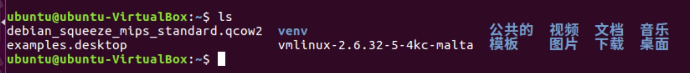

# 实验九 Fuzzing

## 实验要求

* 搜集市面上主要的路由器厂家、在厂家的官网中寻找可下载的固件。在CVE漏洞数据中查找主要的家用路由器厂家的已经公开的漏洞，选择一两个能下载到切有已经公开漏洞的固件。如果能下载对应版本的固件，在QEMU中模拟运行。确定攻击面（对哪个端口那个协议进行Fuzzing测试），尽可能多的抓取攻击面正常的数据包（wireshark）。
* 查阅BooFuzz的文档，编写这对这个攻击面，这个协议的脚本，进行Fuzzing。
* 配置BooFuzz QEMU的崩溃异常检测，争取触发一次固件崩溃，获得崩溃相关的输入测试样本和日志。尝试使用调试器和IDA-pro监视目标程序的崩溃过程，分析原理。

## 实验环境

* 虚拟机：Ubuntu16.04 desktop

## 实验步骤

### 环境搭建

####qemu安装

1. [教程]((https://www.freebuf.com/vuls/228726.html))中漏洞分析的基础环境为前期的Ubuntu18.04虚拟机和基于qemu-4.0.0源码编译安装的Qemu运行环境，因此先安装qemu

    ```bash
    sudo apt-get install libglib2.0-0
    sudo apt-get install libglib2.0-dev
    sudo apt-get install libtool
    sudo apt-get install libsdl1.2-dev
    sudo apt-get install libpixman-1-dev
    sudo apt-get install autoconf
    sudo apt-get install qemu
    sudo apt-get install qemu-user-static
    ```

* qemu安装成功

   

2. 从站点https://people.debian.org/~aurel32/qemu/mips/下载debianmips qemu镜像，由于虚拟机是Ubuntu linux，下载debian_squeeze_mips_standard.qcow2和vmlinux-2.6.32-5-4kc-malta即可：

    ```bash
    wget https://people.debian.org/~aurel32/qemu/mips/debian_squeeze_mips_standard.qcow2
    wget https://people.debian.org/~aurel32/qemu/mips/vmlinux-2.6.32-5-4kc-malta
    ``` 

   

#### MIPS系统网络配置

* 使用QEMU 模拟运行MIPS系统，需要将ubuntu虚拟机设置成桥接，这样以来ubuntu系统就可以和QEMU虚拟机进行通信和数据传输（此操作类似配置VMware Workstation的桥接用以与物理机的通信）。

1. 获取安装依赖，执行以下命令：

    ```bash
    sudo apt-get install bridge-utils uml-utilities
    ```
2. 修改ubuntu主机网络配置，将ubuntu的网络接口配置文件 /etc/network/interfaces 修改为如下内容并保存、关闭：

    ```bash
    sudo gedit /etc/network/interfaces
    ```

    

3. 修改QEMU的网络接口启动脚本，重启网络使配置生效，执行以下命令：

    ```bash
    sudo gedit /etc/qemu-ifup
    ```

* 在脚本文件/etc/qemu-ifup结尾增加如下内容：

   

4. 保存文件/etc/qemu-ifup 以后，赋予可执行权限，然后重启网络使所有的配置生效：

    ```bash
    sudo chmod a+x /etc/qemu-ifup
    sudo /etc/init.d/networking restart
    ```

    

#### QEMU启动配置

1. Qemu运行之前先启动桥接网络，在本地ubuntu命令行终端执行以下命令（注意：ens33为ubuntu默认网卡）：

    ```bash
    sudo ifdown ens33
    sudo ifup br0
    ```

    

#### QEMU MIPS虚拟机启动

1. 进入前面下载的mips镜像目录，执行以下命令：

    ```bash
    sudo qemu-system-mips -M malta -kernel vmlinux-2.6.32-5-4kc-malta -hda debian_squeeze_mips_standard.qcow2 -append "root=/dev/sda1 console=tty0" -net nic,macaddr=00:16:3e:00:00:01 -net tap
    ```

    

2. 输入root/root便可登入qemu mips虚拟机，为了更便操作mips虚拟机，可在unbuntu中新开启一个终端，ssh连接到qemu mips：

    

#### 固件模拟运行

1. 从DLink官网下载包含漏洞版本的路由器固件：```ftp://ftp2.dlink.com/PRODUCTS/DIR-859/DIR-859_REVA_FIRMWARE_v1.05B03.zip```，并解压

2. 安装 binwalk

    ```bash
    sudo apt-get install python-lzma
    sudo git clone https://github.com/devttys0/binwalk
    cd binwalk  
    sudo python setup.py install
    ```  

* 这里我们在主机上下载好zip文件之后通过共享文件夹传给虚拟机，并用binwalk命令解压缩

   

##### 借助firmadyne工具运行固件

* [firmadyne](https://github.com/firmadyne/firmadyne)是一款自动化和可裁剪的嵌入式Linux系统固件分析框架，它支持系统固件逆向QEMU嵌入式系统模拟执行，使用其可模拟路由器固件、执行路由器。

2. Firmadyne安装之前，先根据[安装教程](https://github.com/attify/firmware-analysis-toolkit)安装firmware-analysis-toolkit，安装完成之后在firmware-analysis-toolkit目录中创建firmadyne目录并下载安装Firmadyne。各自全部安装完成后如下所示（注意两个工具须完全按照步骤安装完成，否则后续固件运行会出错）：
    ```bash
    sudo git clone --recursive https://github.com/attify/firmware-analysis-toolkit.git
    ```

    

1. 进入Firmadyne目录，下载Firmadyne。然后打开`firmadyne.config`，修改 FIRMWARE_DIR的路径为当前Firmadyne目录的绝对路径
    ```bash
    cd firmware-analysis-toolkit
    sudo git clone https://github.com/firmadyne/firmadyne
    ```

    

    ```bash
    cd firmware-analysis-toolkit/firmadyne
  
    vim firmadyne.config
    # 以下为firmadyne.config中的内容
    FIRMWARE_DIR=/home/firmware-analysis-toolkit/firmadyne/
    ```  

    

2. 安装Firmadyne

    ```bash
    sudo sh ./download.sh
    sudo ./setup.sh
    ```  

      

     * 需要的安装时间非常长

* 安装postgresql数据库

    ```bash
    sudo apt-get install postgresql
    #用户的用户名和密码设置为：firmadyne
    sudo -u postgres createuser -P firmadyne
    sudo -u postgres createdb -O firmadyne firmware

    # 注意这里的数据库文件是在firmadyne/目录下，也就是该命令要在根目录firmware-analysis-toolkit/目录下执行
    sudo -u postgres psql -d firmware < ./firmadyne/database/schema
    ```  

* 启动postgresql数据库

    ```bash
    sudo service postgresql start
    sudo service postgresql status
    ```       

           

  * 运行
    * 将 firmware-analysis-toolkit 目录下的 fat.py 和 reset.py 文件移动到 firmadyne

    ```bash
    sudo mv fat.py /home/firmware-analysis-toolkit/firmadyne/
    sudo mv reset.py /home/firmware-analysis-toolkit/firmadyne/
    ```

    

* 修改fat.py中的执行权限、firmadyne的路径`firmadyne_path`以及root密码`root_pass`

      ```bash
      sudo chmod +x fat.py
  
      sudo vim fat.py
      #Configurations - change this according to your system
      firmadyne_path = "/home/firmware-analysis-toolkit/firmadyne"
      binwalk_path = "/usr/local/bin/binwalk"
      root_pass = "toor"#当前系统密码
      firmadyne_pass = "firmadyne"#数据库密码
      ```    

    

* 将固件bin文件拷贝至firmadyne目录，继续执行以下命令：
    ```bash
    sudo mv DIR859Ax_FW105b03.bin /home/firmware-analysis-toolkit/firmadyne
    ```
    
* 执行以下命令
    ```bash
    rm -rf images*
    python3 reset.py
    ./sources/extractor/extractor.py -b Dlink -sql 127.0.0.1 -np -nk "DIR-859_REVA_FIRMWARE_v1.05B03.zip" images
    ./scripts/getArch.sh ./images/1.tar.gz
    ./scripts/makeImage.sh 1
    ./scripts/inferNetwork.sh 1
    ./scratch/1/run.sh 
    ```  

    * 但是，在执行reset.py时一直报错

    

    * 上网查询，应该是postgresql数据库的问题，尝试了重装重启等均无效果。以下是教程中执行命令后应当出现的结果

    

    

* Ubuntu中打开浏览器，输入192.168.0.1即可访问仿真路由器

    

## 参考文献

* [TP-Link SR20 本地网络远程代码执行漏洞复现分析](https://zhuanlan.zhihu.com/p/93020741?from_voters_page=true)
* [firmadyne](https://github.com/firmadyne/firmadyne)
* [firmware-analysis-toolkit](https://github.com/attify/firmware-analysis-toolkit)
*[物联网设备固件分析：Firmadyne固件模拟环境搭建](https://blog.csdn.net/qq_35056292/article/details/99674670)