# 实验九-cuckoo实验报告

## 实验要求

* 安装并使用cuckoo，任意找一个程序，在cuckoo中trace获取软件行为的基本数据

## 实验环境

* 主机：Ubuntu 16.04 desktop
* 客机：Windows 7

## 实验步骤

### 主机搭建

1. 安装python

* cuckoo主要组件完全用python编写，需要安装python和一些软件包，但是他只支持python2.7

    ```bash
    $ sudo apt-get install python python-pip python-dev libffi-dev libssl-dev
    $ sudo apt-get install python-virtualenv python-setuptools
    $ sudo apt-get install libjpeg-dev zlib1g-dev swig
    $ sudo apt-get install -y libtiff5-dev libjpeg8-dev libfreetype6-dev liblcms2-dev libwebp-dev tcl8.6-dev tk8.6-dev python-tk
    ```

2. 安装MongoDB

* 安装MongoDB是为了使用Django的web界面

    ```bash
    $ sudo apt-get install mongodb
    $ sudo apt-get install postgresql libpq-dev
    $ sudo apt-get install qemu-kvm libvirt-bin ubuntu-vm-builder bridge-utils python-libvirt
    $ sudo pip install XenAPI
    $ sudo apt-get install git mongodb libffi-dev build-essential python-django python python-dev python-pip python-pil python-sqlalchemy python-bson python-dpkt python-jinja2 python-magic python-pymongo python-gridfs python-libvirt python-bottle python-pefile python-chardet tcpdump -y
    ```

3. 安装Tcpdump

* 他的安装是为了转储恶意软件在执行过程中执行的网络活动

    ```bash
    # install Tcpdump
    sudo apt-get install tcpdump apparmor-utils
    sudo aa-disable /usr/sbin/tcpdump
    $ sudo setcap cap_net_raw,cap_net_admin=eip /usr/sbin/tcpdump
    # 验证上列指令
    $ getcap /usr/sbin/tcpdump
    #输入/usr/sbin/tcpdump = cap_net_admin,cap_net_raw+eip
    ```
    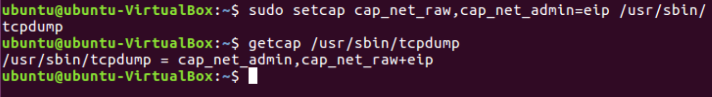

4. 安装Volatility

* cuckoo利用Volatility检查样本是否有使用逃避Cuckoo分析的rootkit技术
    ```bash
    $ sudo apt-get install -y volatility
    ```

5. 安装M2Crypto

* M2Crypto仅在安装了SWIG后才支持该库。swig在前面的步骤中我们已经安装过了。接下来安装M2Crypt

    ```bash
    $ sudo pip install m2crypto==0.24.0
    ```

  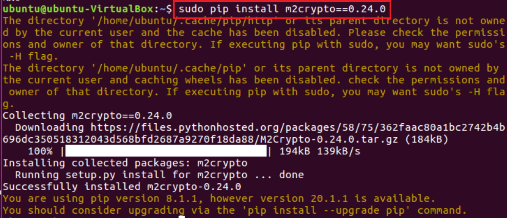

6. 安装Cuckoo

* 在virtualenv中安装

    ```bash
    $ virtualenv venv
    $ . venv/bin/activate
    (venv)$ pip install -U pip setuptools
    (venv)$ pip install -U cuckoo
    ```
* 经过漫长的安装过程，cuckoo安装完成了

   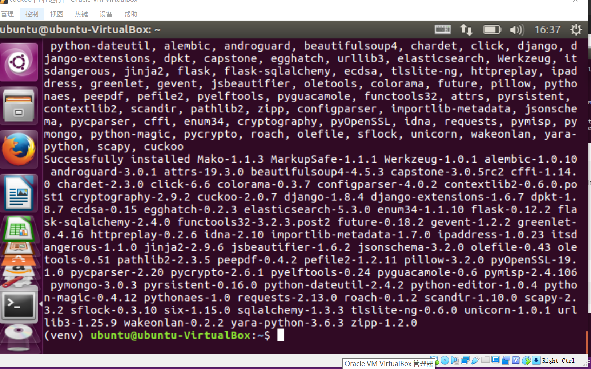

* 输入 ```cuckoo -d```，成功运行。

   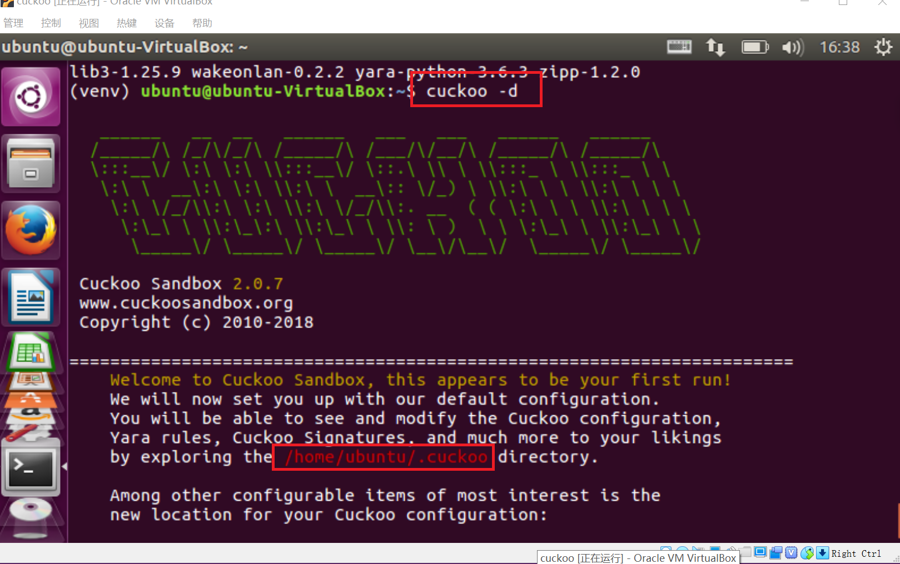

* 检查是否生成CWD文件 ，文件路径： /home/ubuntu/.cuckoo/agent/agent.py 如果username下没有出现.cuckoo文件，因为它是隐藏文件可以使用快捷键ctrl+H显示隐藏文件。

   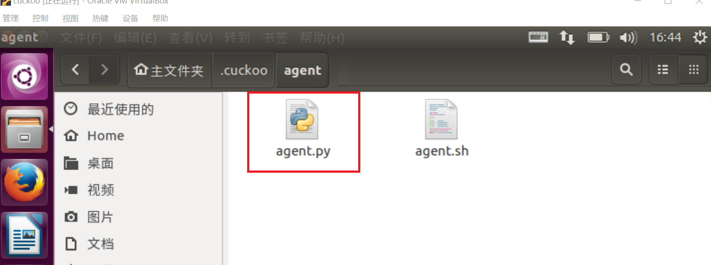

### 客机搭建（windows 7）

1. 关闭防火墙、自动更新、UAC

    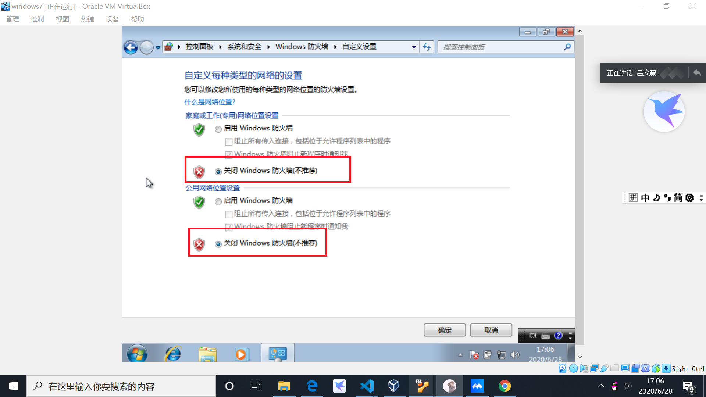

    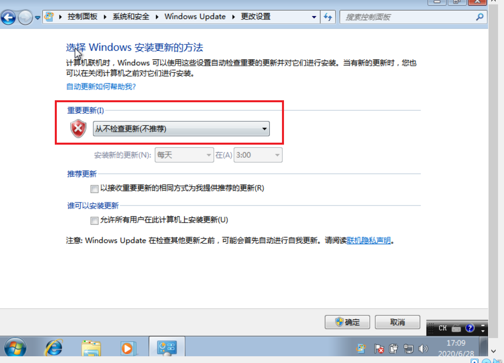

    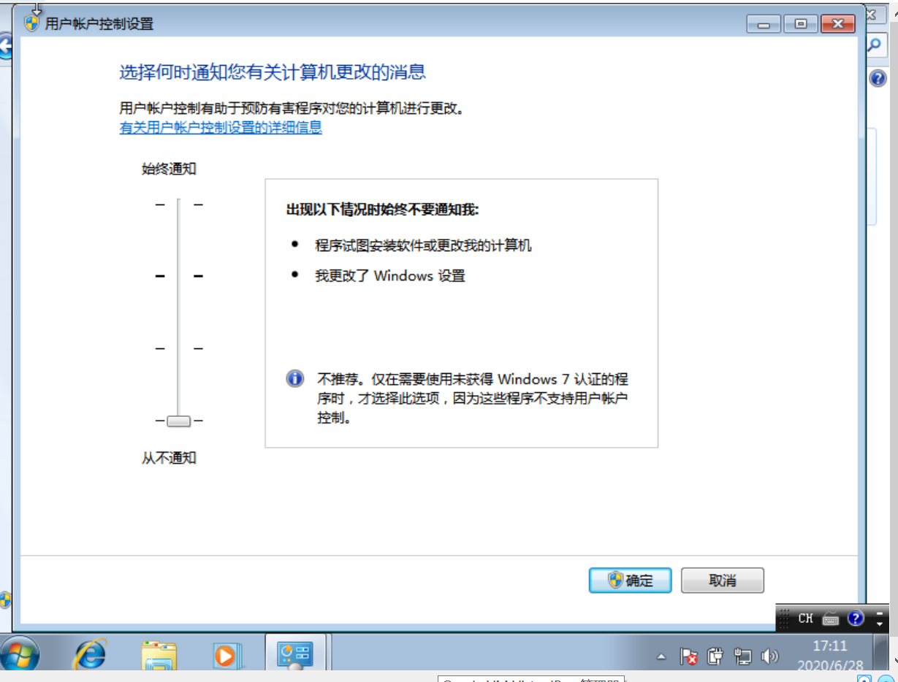

2. win7安装python2.7，因为win7无法访问python官网，改为主机下载python安装包后通过共享文件夹传给win7虚拟机。安装完成

   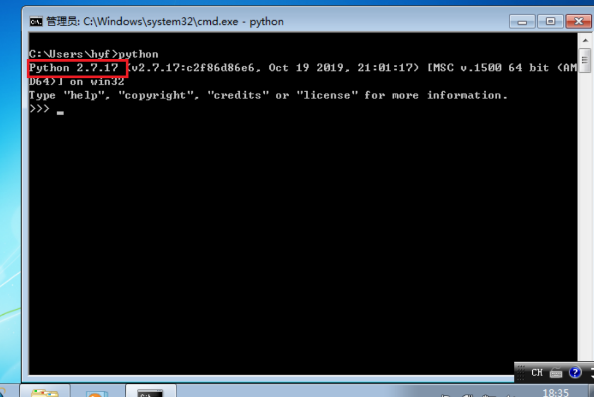

3. 安装PIL
* 此功能用于截屏，cuckoo生成报告中会有windows 7的截图。
首先进到C:\Python27\Scripts路径下，在此路径下安装pillow。

    ```bash
    cd C:\Python27\Scripts
    pip install Pillow
    ```

   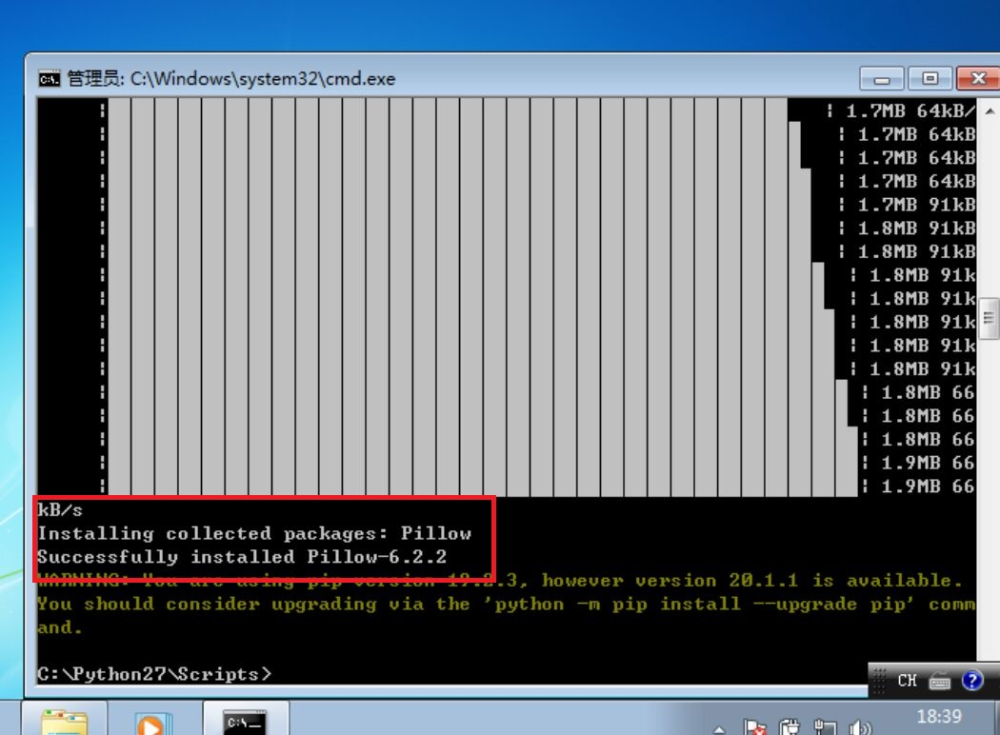

* python2.7.10以上版本自带pip，无需另外安装，安装python的时候建议选一个版本高一点的。

4. agent.py设置开机自启动。将agent.py文件移动到win7中

    ```bash
    cd /home/ubuntu/.cuckoo/agent
    sudo mv agent.py /mnt/share
    ```

* 把上传成功的agent.py文件放进C:\Users\hyf\AppData\Roaming\MicroSoft\Windows\Start Menu\Programs\Startup\ 下，并把后缀名改为.pyw。

  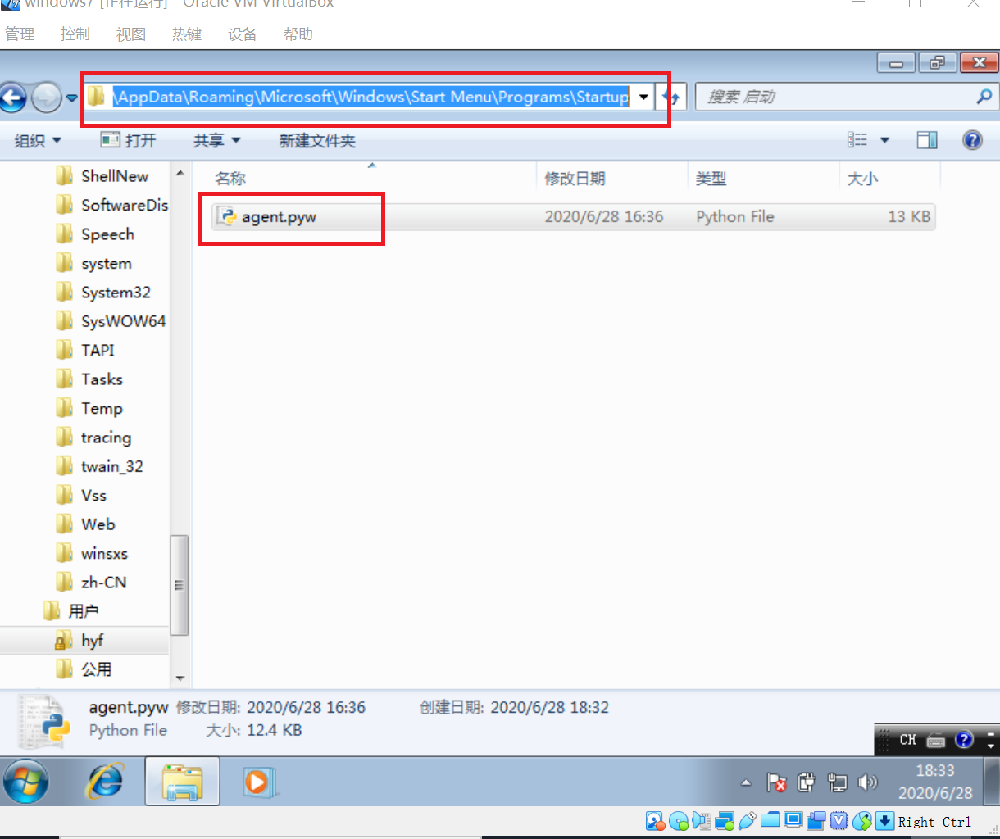

5. 配置系统开机自动登录
使用Administrator权限启动cmd,并依序在cmd中输入以下指令
[USERNAME]和[PASSWORD]需替换为登入的Windows user与对应的password

    ```bash
    >reg add "hklm\software\Microsoft\Windows NT\CurrentVersion\WinLogon" /v DefaultUserName /d [USERNAME] /t REG_SZ /f
    >reg add "hklm\software\Microsoft\Windows NT\CurrentVersion\WinLogon" /v DefaultPassword /d [PASSWORD] /t REG_SZ /f
    >reg add "hklm\software\Microsoft\Windows NT\CurrentVersion\WinLogon" /v AutoAdminLogon /d 1 /t REG_SZ /f
    >reg add "hklm\system\CurrentControlSet\Control\TerminalServer" /v AllowRemoteRPC /d 0x01 /t REG_DWORD /f
    >reg add "HKEY_LOCAL_MACHINE\SOFTWARE\Microsoft\Windows\CurrentVersion\Policies\System" /v LocalAccountTokenFilterPolicy /d 0x01 /t REG_DWORD /f
    ```

### 配置连接网络

1. 在virtualbox中添加一块网卡，管理——主机网络管理器，按照下面信息进行设置。

   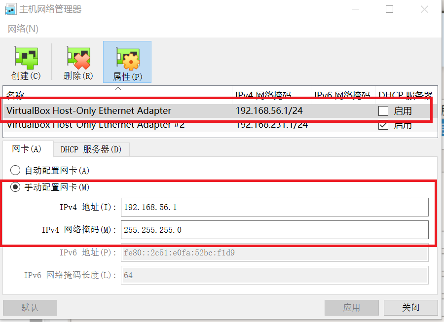

* 取消勾选DHCP服务器

2. 设置windows 7网络，设置为Host-Only。界面名称为刚刚设置的网卡

   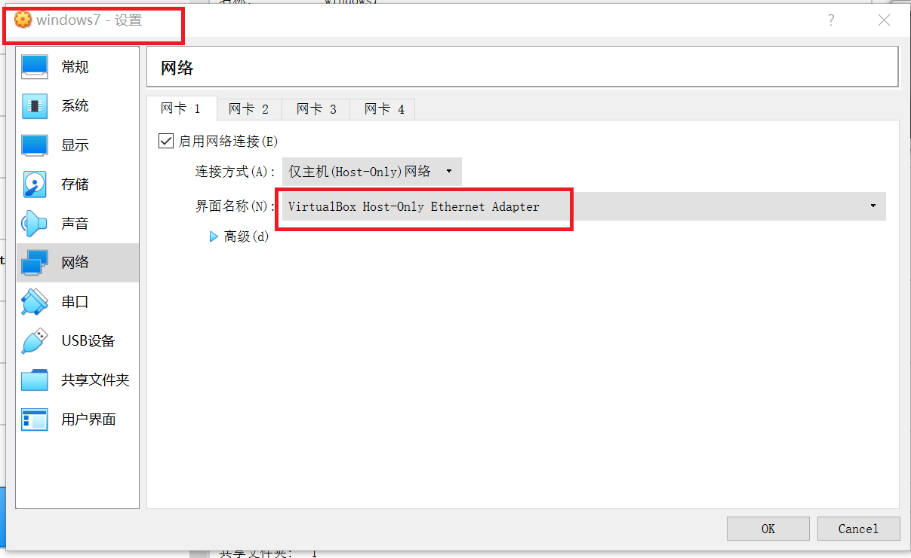

3. 进入Windows 7 系统，设置win7 ip网络
    ```bash
    控制面板->网络和 Internet->网络连接->本地连接->右键属性->IPV4
    ```

   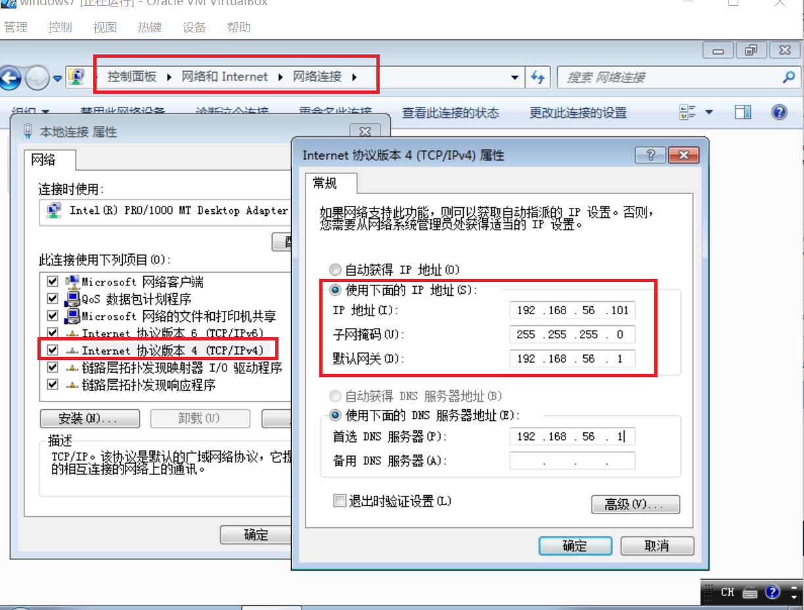

4. 检查是否配置成功，主机和客机是否能通信。

* 客机ping 192.168.56.1

   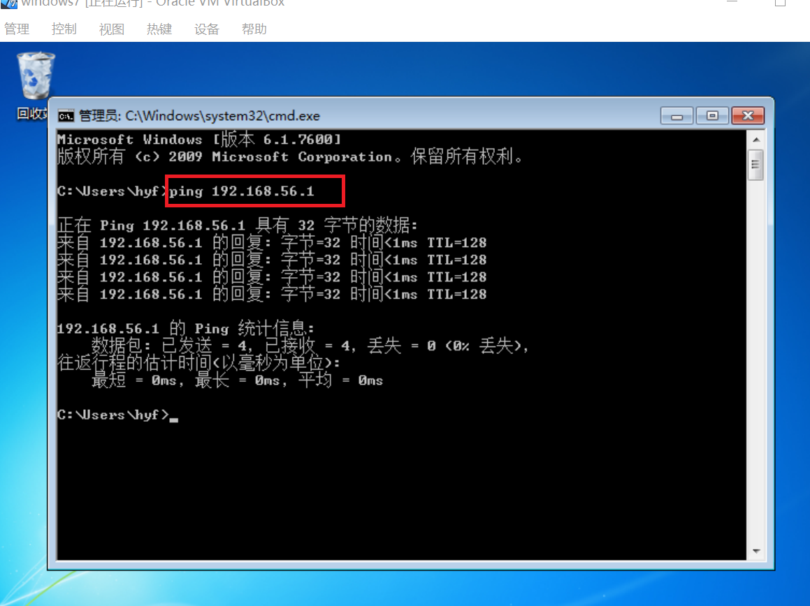

* 主机ping 192.168.56.101

   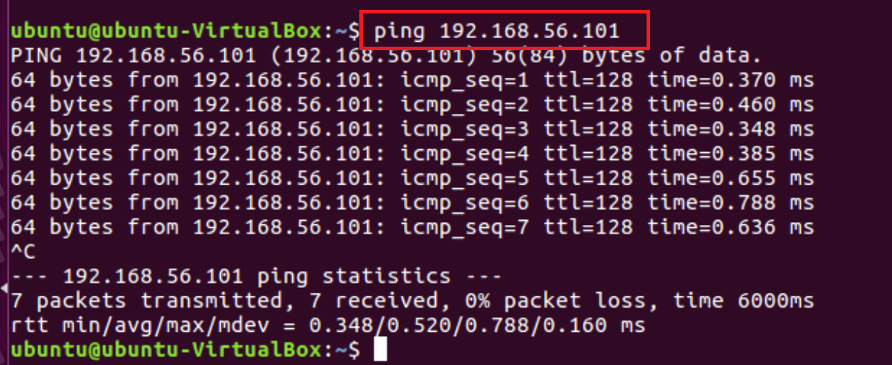

* 注意客机防火墙必须处于关闭状态，否则无法ping通

5. 设置IP报文转发
这是在Ubuntu中的操作，因为win7无法上网，所以要通过主机才能访问网络，所以需要以下操作;
流量转发服务：

    ```bash
    $ sudo vim /etc/sysctl.conf
    net.ipv4.ip_forward=1

    ```

   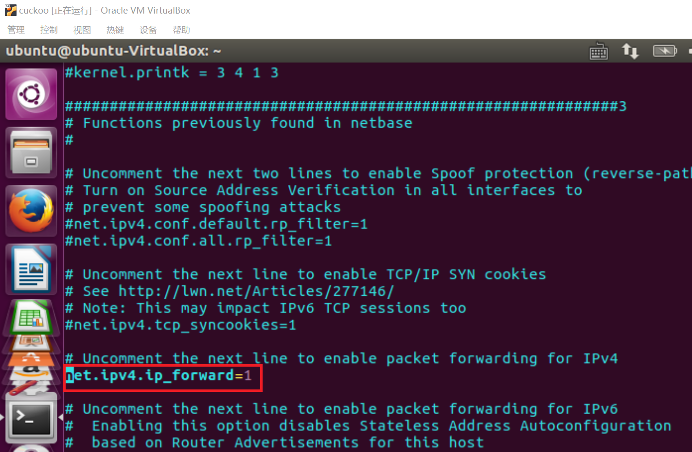

6. 使用iptables提供NAT机制
注意：其中eth0为Ubuntu中的网卡名称，需要提前查看自己Ubuntu中的网卡名称然后修改eth0

    ```bash
    
    $ sudo iptables -A FORWARD -o ens33 -i enp0s8 -s 192.168.56.0/24 -m conntrack --ctstate NEW -j ACCEPT
    $ sudo iptables -A FORWARD -m conntrack --ctstate ESTABLISHED,RELATED -j ACCEPT
    $ sudo iptables -A POSTROUTING -t nat -j MASQUERADE
    $ sudo vim /etc/network/interfaces
    # 增加下面两行
    pre-up iptables-restore < /etc/iptables.rules #开机自启动规则
    post-down iptables-save > /etc/iptables.rules #保存规则
    ```      

    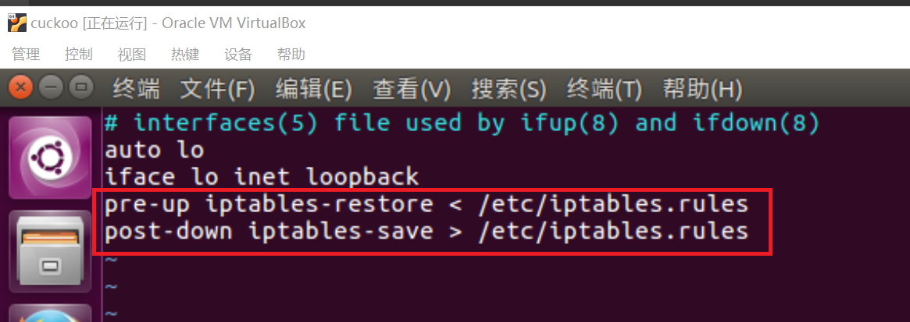

7. 备份一下

    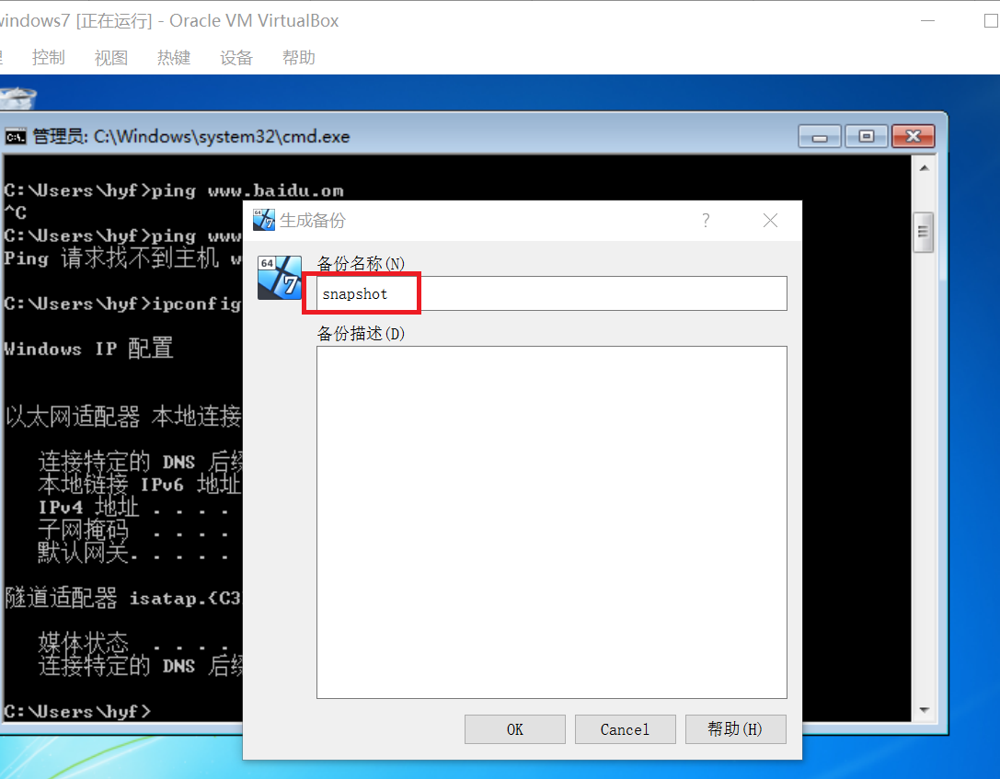

## 设置cuckoo配置文件

1. 现在我们再次转到Ubuntu中

* conf档案放置在Ubuntu中得CWD/conf中，预设在~/.cuckoo/conf
配置virtualbox.conf

    ```bash
    machines = hyf
    [hyf] 
    label = hyf .
    platform = windows
    ip = 192.168.56.101
    snapshot =snapshot
    ```

    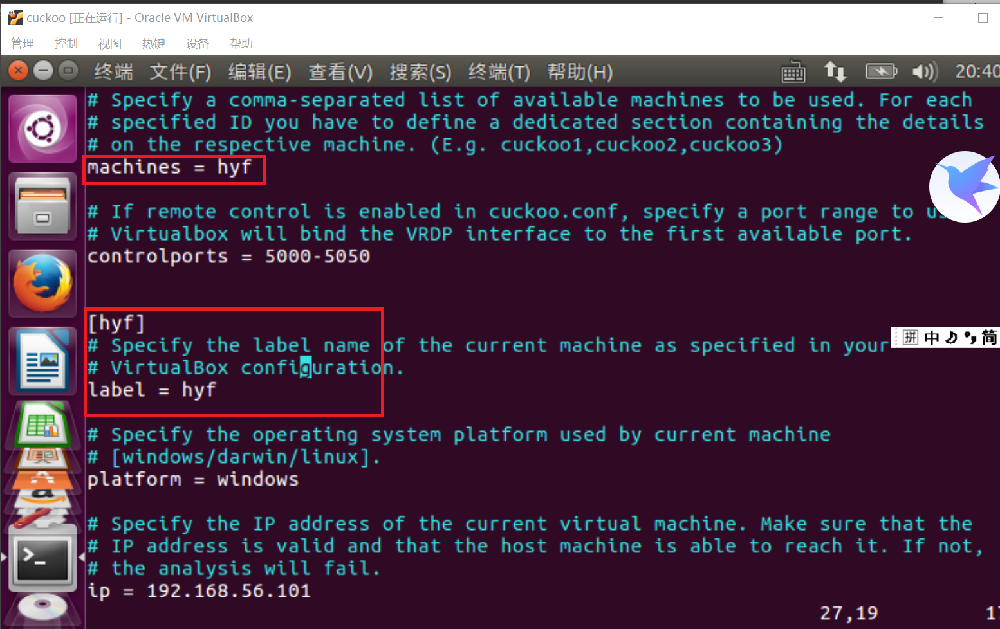

 * 配置reporting.conf
 
    ```bash
    $ vim reporting.conf
    [jsondump]
    enabled = yes # no -> yes
    indent = 4
    calls = yes
    [singlefile]
    # Enable creation of report.html and/or report.pdf?
    enabled = yes # no -> yes
    # Enable creation of report.html?
    html = yes # no -> yes
    # Enable creation of report.pdf?
    pdf = yes # no -> yes
    [mongodb]
    enabled = yes # no -> yes
    host = 127.0.0.1
    port = 27017
    db = cuckoo
    store_memdump = yes 
    paginate = 100
    ```

    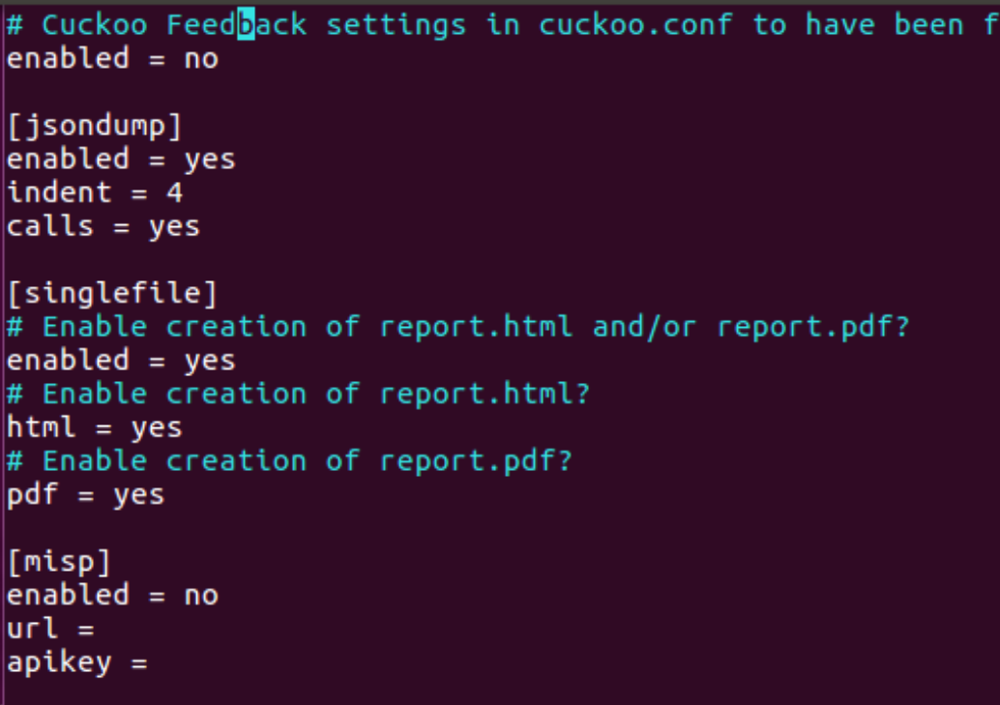

    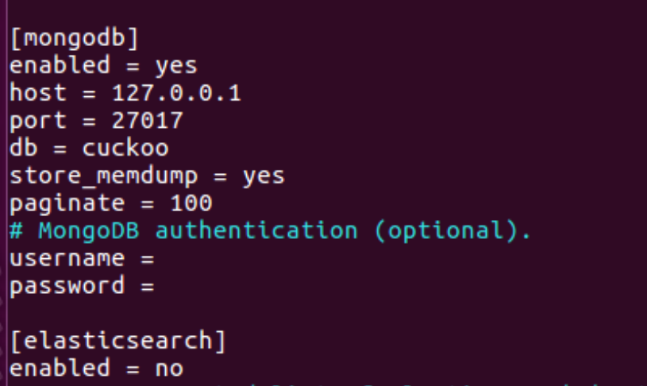

  * 配置cuckoo.conf
    ```bash
    $ vim cuckoo.conf
    version_check = no
    machinery = virtualbox
    memory_dump = yes
    [resultserver]
    ip = 192.168.56.1
    port = 2042
    ``` 

### 启动cuckoo服务

1. 进入venv中，输入命令启动cuckoo服务：

    ```bash
    cuckoo
    ```

2. 启动成功后，另外开出一个控制台，启动cuckoo web服务
    ``` bash
    cuckoo web
    ```
    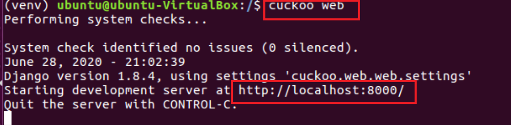

3. 启动成功后，会给出一个网站```http://localhost:8000```，用浏览器进行打开：

    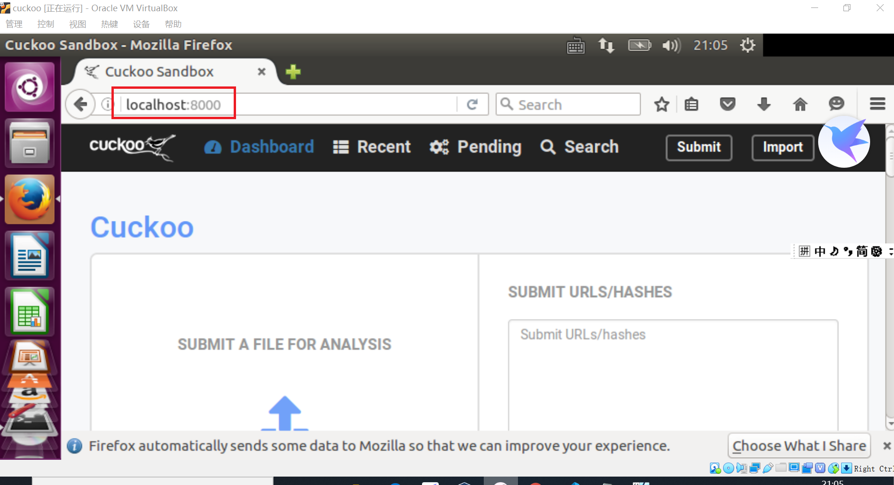

4. 选择一个exe文件进行分析

    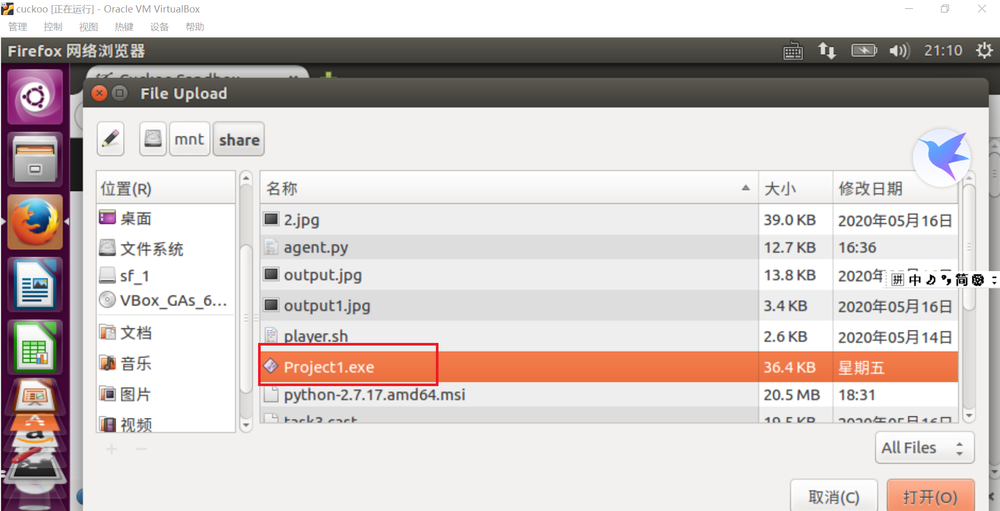

5. cuckoo对文件进行分析

    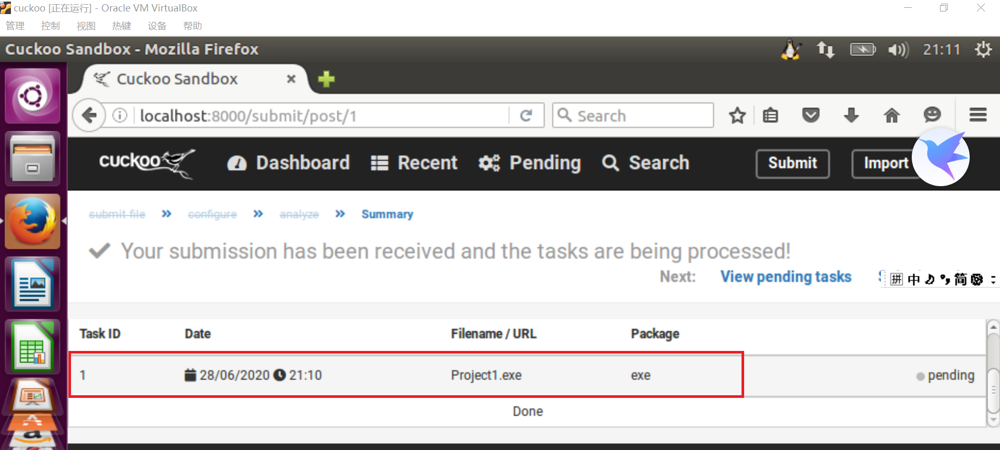

## 参考文献

* [Win7如何修改IP](https://jingyan.baidu.com/article/425e69e621f161be14fc166a.html)

* [VirtualBox创建Windows与Ubuntu的共享文件夹](https://blog.csdn.net/z191726501/article/details/78484767)

* [自动化恶意软件分析系统Cuckoo安装、配置详解](https://blog.csdn.net/D_R_L_T/article/details/79188968?utm_source=blogxgwz5)