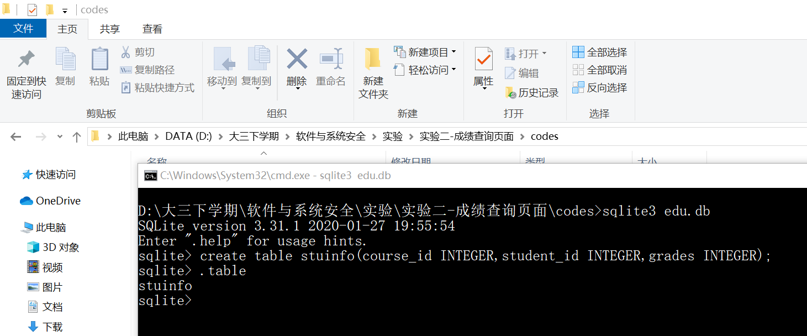
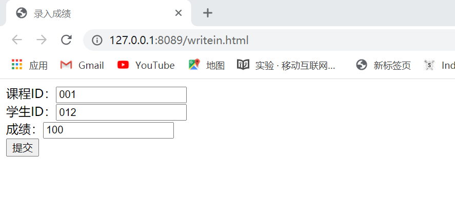
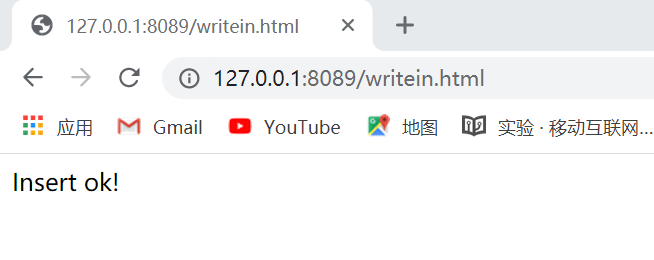

# 简易教务系统的web开发过程

## 实验要求

* 在不使用Django的情况下，使用更底层的python的sqlite库来编程操作数据库
* 在httpserver.py的基础上，继续编写漏洞。写两个页面，一个是教师录入成绩页面，一个是学生查询成绩页面。教师录入成绩页面表单有三个字段，课程id，学生id，成绩。录入提交以后，httpserver调用sqlite库使用sql语句写入数据库。
* 学生查询成绩表单，学生输入学生id，课程id，httpserver使用sql语句查询成绩后返回给用户（课程用直接输入id的方式）。

## 实验过程

### 一、创建数据库

* 参考[sqlite3文档](https://docs.python.org/3/library/sqlite3.html)用sqlite3创建数据库edu.db

    

### 二、编写查询页面

仿照老师给出的示例，一个页面是一个是教师录入成绩页面，一个是学生查询成绩页面。

* 教师录入成绩页面如下：

    ```html
    <!DOCTYPE html>
    <html>
        <head>
            <meta charset="utf-8">
            <title>录入成绩</title>
        </head>
        <body>
            <form method='post'>
                课程ID：<input type='text' name='course_id'><br>
                学生ID：<input type='text' name='student_id'><br>
                成绩：<input type='text' name='grades'><br>
            <input type='submit' name="录入成绩">
            </form>
        </body>
    </html>
    ```

* 学生成绩查询界面如下：

    ```html
    <!DOCTYPE html>
    <html>
        <head>
            <meta charset="utf-8">
            <title>查询成绩</title>
        </head>
        <body>
            <form method='post'>
                课程ID：<input type='text' name='course_id'><br>
                学生ID：<input type='text' name='student_id'><br>
            <input type='submit'name="查询成绩" >
            </form>
        </body>
    </html>
    ```

三、改写httpserver.py

```python
# -*- coding: utf-8 -*-

import sys
import cgi
from http.server import HTTPServer, BaseHTTPRequestHandler
import sqlite3

class MyHTTPRequestHandler(BaseHTTPRequestHandler):
    field_name = 'a'
    form_html = \
        '''
        <html>
        <body>
        <form method='post' enctype='multipart/form-data'>
        <input type='text' name='%s'>
        <input type='submit'>
        </form>
        </body>
        </html>
        ''' % field_name

    def do_GET(self):
        self.send_response(200)
        self.send_header("Content-type", "text/html")
        self.end_headers()
        try:
            file = open("."+self.path, "rb")
        except FileNotFoundError as e:
            print(e)
            self.wfile.write(self.form_html.encode())
        else:
            content = file.read()
            self.wfile.write(content)

    def do_POST(self):
        grades='OK'
        flag=0
        form_data = cgi.FieldStorage(
            fp=self.rfile,
            headers=self.headers,
            environ={
                'REQUEST_METHOD': 'POST',
                'CONTENT_TYPE': self.headers['Content-Type'],
            })
        fields = form_data.keys()
        print(fields)
        if self.field_name in fields:
            input_data = form_data[self.field_name].value
            file = open("."+self.path, "wb")
            file.write(input_data.encode())
            flag=0
        
        elif 'grades' in fields:   #录入成绩
            course_id, student_id, grades = form_data['course_id'].value,\
                                            form_data['student_id'].value, \
                                            form_data['grades'].value
            conn = sqlite3.connect('edu.db')
            c = conn.cursor()
            sql = "insert into stuinfo values (%s, %s, %s)"%(course_id, student_id, grades)
            c.execute(sql)
            conn.commit()
            conn.close()
            flag=1

        else:                       #查询成绩
            course_id, student_id = form_data['course_id'].value, form_data['student_id'].value
            conn = sqlite3.connect('edu.db')
            c = conn.cursor()
            sql = "select grades from stuinfo where course_id=%s and student_id=%s"%(course_id, student_id)
            c.execute(sql)
            grades = "%s 同学 %s 课程的成绩为:  " % (student_id, course_id) + str(c.fetchone()[0])
            conn.close()
            flag=2
    

        self.send_response(200)
        self.send_header("Content-type", "text/html")
        self.end_headers()
        if flag==0:
            self.wfile.write(b"<html><body>OK</body></html>")
        elif flag==1:
            self.wfile.write(b"<html><head><meta charset='utf-8'></head><body>Insert ok!</body></html>")
        else: 
            self.wfile.write(bytes(str("<html><head><meta charset='utf-8'></head><body>%s</body></html>"%(grades)),'utf-8'))

class MyHTTPServer(HTTPServer):
    def __init__(self, host, port):
        print("run app server by python!")
        HTTPServer.__init__(self,  (host, port), MyHTTPRequestHandler)


if '__main__' == __name__:
    server_ip = "0.0.0.0"
    server_port = 8080
    if len(sys.argv) == 2:
        server_port = int(sys.argv[1])
    if len(sys.argv) == 3:
        server_ip = sys.argv[1]
        server_port = int(sys.argv[2])
    print("App server is running on http://%s:%s " % (server_ip, server_port))

    server = MyHTTPServer(server_ip, server_port)
    server.serve_forever()
```

三、运行结果

1. 录入成绩，如图输入课程ID，学生ID，成绩

   

* 录入成功

    

2. 查询成绩，如图输入课程ID，学生ID进行查询

   

* 查询成功
    
