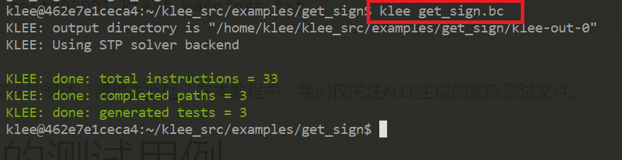
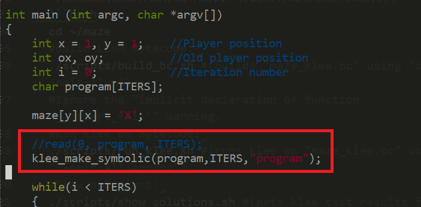

# klee实验报告

## 实验要求

* 安装KLEE，完成[官方tutorials](https://klee.github.io/tutorials/testing-function/)

* 至少完成前三个

## 实验环境

* ubuntu18.04 server
* cmder

## 环境搭建

1. 根据[官网教程](https://docs.docker.com/engine/install/ubuntu/)安装docker 
    ```bash
    #更新apt包索引：
    $ sudo apt-get update
    #安装以下包以使apt可以通过HTTPS使用存储库（repository）：
    $ sudo apt-get install -y apt-transport-https ca-certificates curl software-properties-common
    #添加Docker官方的GPG密钥：
    $ curl -fsSL https://download.docker.com/linux/ubuntu/gpg | sudo apt-key add -
    #使用下面的命令来设置stable存储库：
    $ sudo add-apt-repository "deb [arch=amd64] https://download.docker.com/linux/ubuntu $(lsb_release -cs) stable"
    #再更新一下apt包索引：
    $ sudo apt-get update
    #安装最新版本的Docker CE：（需要一定时间）
    $ sudo apt-get install -y docker-ce
    #查看docker是否安装成功
    systemctl status docker 
    ```

* docker安装完成

    

2. 在docker中安装klee

    ```bash
        # 安装 KLEE
        sudo docker pull klee/klee:2.0
    ```
   

## 实验步骤

### Testing a Small Function

1. 创建一个容器
    ```bash
    sudo docker run --rm -ti --ulimit='stack=-1:-1' klee/klee:2.0
    ```

   

2. 示例代码`get_sign.c`在 `/klee_src/examples/get_sign` 目录下

   

3. KLEE使用LLVM位码进行操作。要使用KLEE运行程序，请先使用将其编译为LLVM位代码clang -emit-llvm。

    ```bash
        clang -I ../../include -emit-llvm -c -g -O0 -Xclang -disable-O0-optnone get_sign.c
    ```

* 生成get-sign.bc文件  


4. 要在位码文件上运行KLEE，只需执行以下命令：

    ```bash
    klee get_sign.bc
    ```

* 通过我们的简单函数可以通过三条路径，一个在a处0，一个在小于a处，一个在0大于a处0。KLEE告知我们它探索了程序中的三个路径，并为每个探索的路径生成了一个测试用例。

  

* KLEE执行的输出是一个目录（在本例中为klee-out-0），其中包含KLEE生成的测试用例。KLEE将输出目录命名为可用目录klee-out-N中N最小的目录（因此，如果再次运行KLEE，它将创建一个名为的目录klee-out-1），并且还会生成一个指向klee-last该目录的符号链接，以方便使用

   

5. KLEE生成的测试用例将写入具有.ktest扩展名的文件中。这些是二进制文件，可以使用ktest-tool实用程序读取。ktest-tool为同一对象输出不同的表示形式，例如Python字节字符串（数据），整数（int）或ascii文本（文本）。


* 在每个测试文件中，KLEE都会报告调用程序的参数（本例没有其他参数），该路径上的符号对象的数量（本例只有一个），符号名称对象（'a'）及其大小（4）。实际测试本身由我们的输入值表示：0对于第一个测试，16843009对于第二个测试，对于-2147483648最后一个测试。正如预期的那样，KLEE产生了0一个值，一个正值（16843009）和一个负值（-2147483648）。

### Testing a Simple Regular Expression Library

1. 第一步是使用编译器编译源代码，该编译器可以生成LLVM位代码格式的目标文件。

    ```bash
    #进入代码所在目录
    cd /home/klee/klee_src/examples/regexp
    #编译生成bc文件
    clang -I ../../include -emit-llvm -c -g -O0 -Xclang -disable-O0-optnone Regexp.c
    ```
 
   

2. 使用 KLEE 运行代码，可以看到代码报错

    ```bash
    klee --only-output-states-covering-new Regexp.bc
    ```

   

3. KLEE在此程序中发现内存错误的原因并不是正则表达式函数存在错误，而是表明我们的测试驱动程序存在问题。问题是我们使输入正则表达式缓冲区完全具有符号性，但是match函数期望它是一个以null终止的字符串。

4.  解决方法：将' \0 '符号化后存储在缓冲区的末尾。修改代码

    

5. 重新将Regexp.c编译转化为 LLVM bitcode，并用klee运行新的Regexp.bc文件即可

   

### tutorial 3:Solving a maze with KLEE

* 这是一个11*7的迷宫问题，程序中故意在迷宫的第二行开了一个后门。该示例显示了如何使用KLEE查找迷宫游戏的所有解决方案。

1. 下载迷宫程序

    ```bash
    # 更新
    sudo apt-get update
    # 下载git
    sudo apt-get install -y git-core
    # 克隆仓库
    git clone https://github.com/grese/klee-maze.git ~/maze
    # 进入maze目录
    cd ~/maze
    #Build:
    gcc maze.c -o maze
    ```

2. 输入命令```./maze```执行程序，此时命令行会等待输入，输入如下

    ```bash
    ssssddddwwaawwddddssssddwwww
    #a代表向左，d代表向右，w代表向上，s代表向下
    ```

   

3. 根据我们的输入会输出每一步的结果，最终可以看到我们走出迷宫

   
4. 修改源代码，把用户手动输入改为符号测试。

* 将read调用改成klee_make_symbolic  

        

* 增加一个`klee_assert(0);`

        

5. 对修改后的源文件重新编译并执行，得到所有成功以及失败的例子

```bash
  cd ~/maze
  ./scripts/build_bc.sh #执行后的报错忽略即可
```

6. 执行```./scripts/run_klee.sh```

   
  
7. 执行```./scripts/show_solutions.sh```，可以看到所有可行的走法

   

