# 实验四实验报告

## 实验要求

* 验证不同进程的相同的地址可以保存不同的数据
  * 在VS中，设置固定基地址，编写两个不同的可执行文件。同时运行这两个文件。然后使用调试器附加到两个程序的进程，查看内存，看两个程序是否使用了相同的内存地址
  * 在不同的进程中，尝试使用 VirtualAlloc 分配一块相同地址的内存，写入不同的数据，再读出

## 实验步骤

1. 新建两个项目，分别写入如图源码：

 * project1

 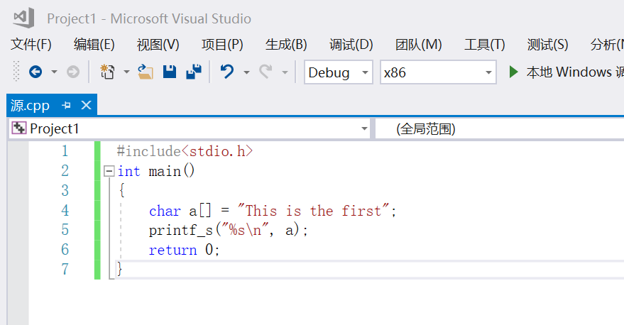

 * project2

 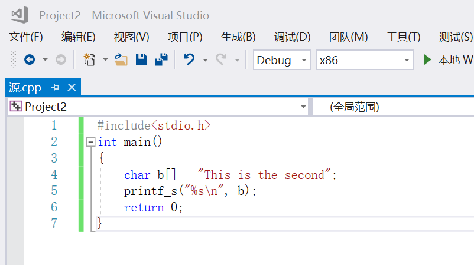

2. 对两个项目都设置固定基址。

* project1

 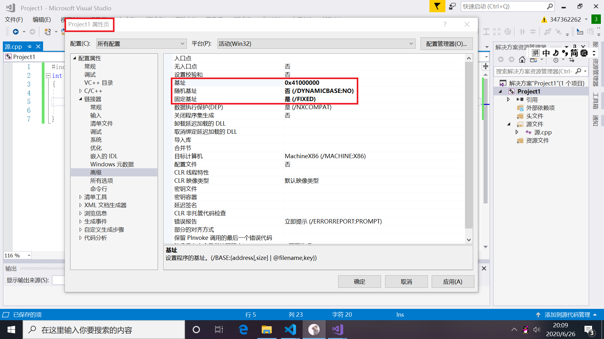

 * project2

 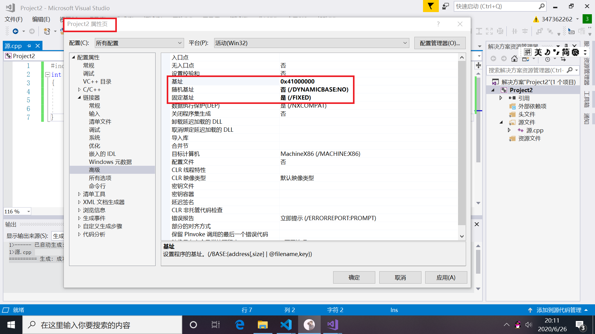

 3. 设置断点，运行两个程序，可以看到两个程序用了相同的内存地址。
 * project1

 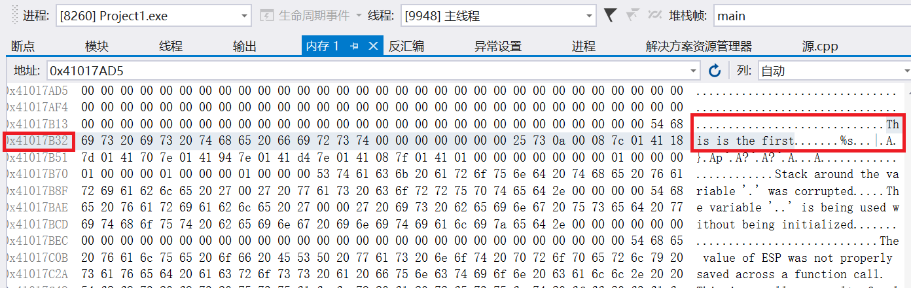

 * project2

 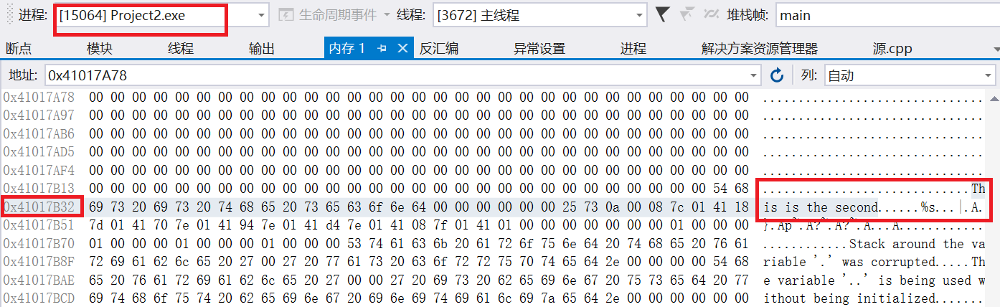

 4. 用VirtualAlloc在两个项目中分别分配地址相同的内存，并如图设置断点。

 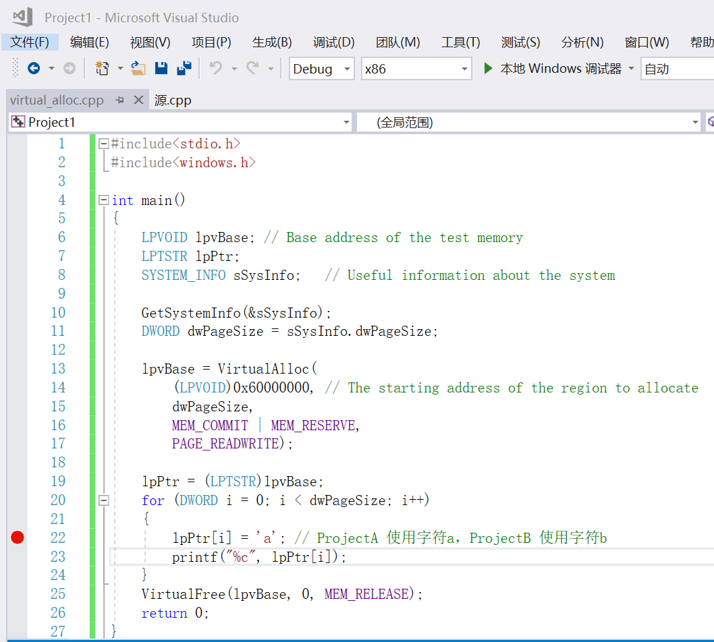

 5. 先运行Project1中的程序(写入字符a)，接着运行Project2中的程序(写入字符b)，可以看到Project2中的数据可以成功写入，也可以成功读出。

* Project1

    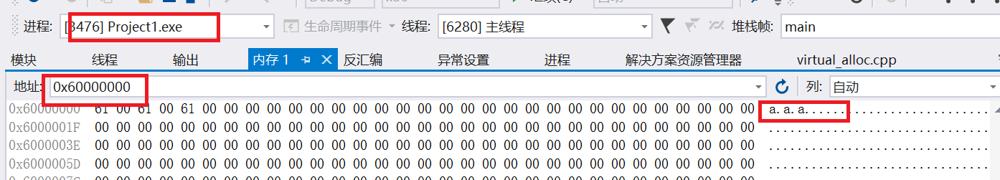

* Project2

    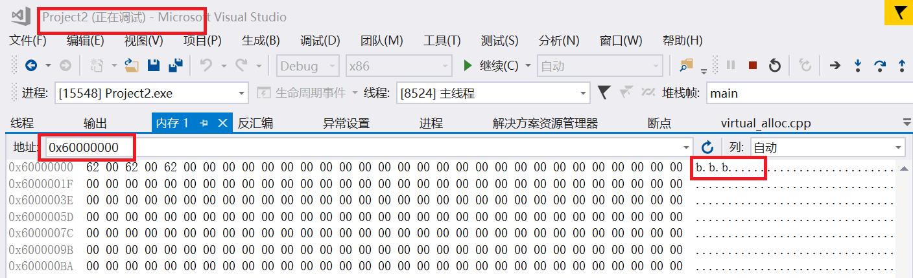

    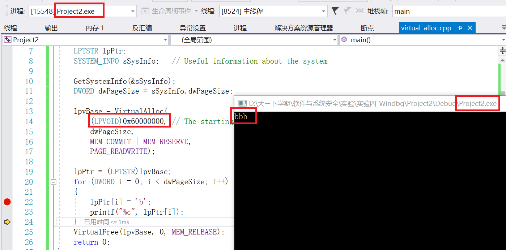

---
## 实验要求

* 配置一个 Windbg 双机内核调试环境，查阅 Windbg 的文档，了解
  * Windbg 如何在内核调试情况下看物理内存，也就是通过物理地址访问内存
  * 如何查看进程的虚拟内存分页表，在分页表中找到物理内存和虚拟内存的对应关系。然后通过 Windbg 的物理内存查看方式和虚拟内存的查看方式，看同一块物理内存中的数据情况

## 实验环境

* Guest win7虚拟机
* Host 安装好windbg的win10

## 实验步骤

一、配置Guest端
1. 为了让Windos支持内核调试，需要配置启动参数。首先需要对虚拟机配置虚拟串口，目的是为了建立host到guest的调试通信连接。如下图所示，选择com1并且映射成为\\.pip\com_1。注意不要选择```连接至现有通道或套接字```，因为目前还没有建立管道。

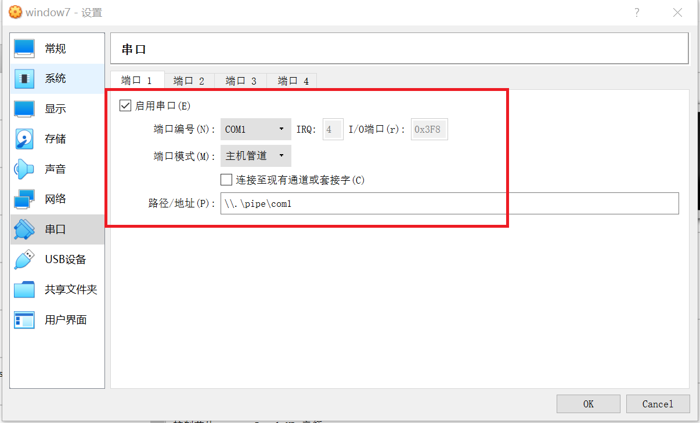

2. 启动虚拟机，进入Window内部进行配置。以管理员身份启动CMD,输入以下命令。

```bash
bcdedit /dbgsettings serial baudrate:115200 debugport:1
bcdedit /copy {current} /d DebugEntry
bcdedit /displayorder {current} {替换第二个命令显示的UUID}
bcdedit /debug {替换第二个命令显示的UUID} on
```
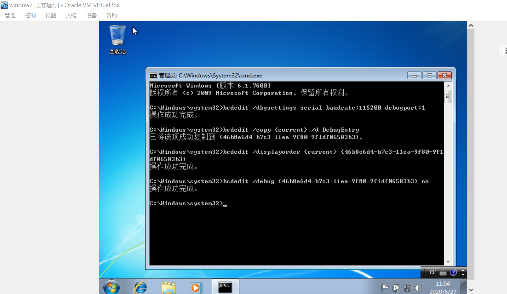

二、配置Host端

1. 在host端首先需要安装windbg,使用以下命令启动windbg
```bash
windbg.exe -k com:port=\.\pipe\com_1,baud=115200,pipe
```

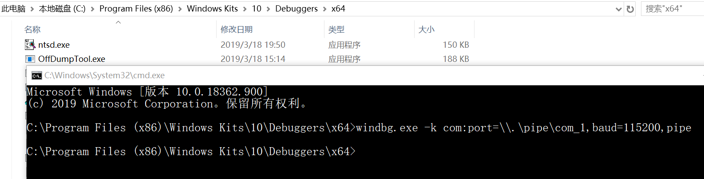

* 注意先启动guest上的win7系统，再启动windbg

2. 配置windbg的符号下载地址。
```bash
srv*E:\WinSym*https://msdl.microsoft.com/download/symbols
```

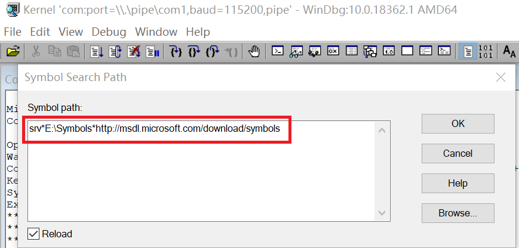

3. 连接成功

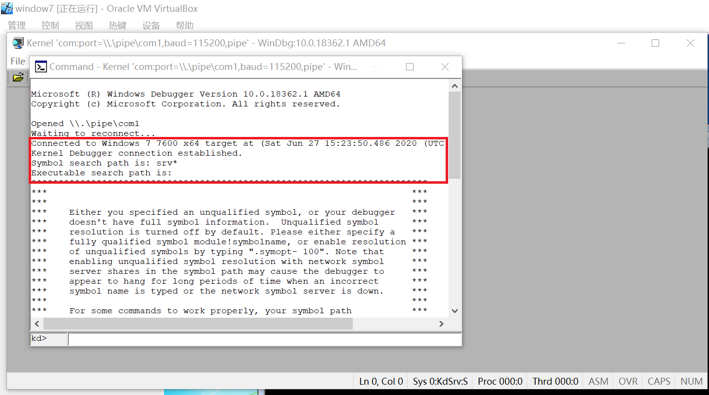

  * 这时待调试的windows还没有被断住，需要使用ctrl+break断住系统。如果想要让虚拟机继续运行就可以输入g

5. 通过物理地址访问内存
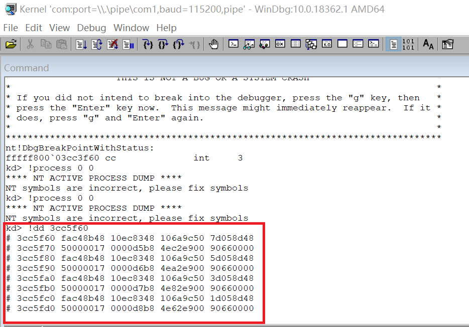

6. 查看虚拟内存
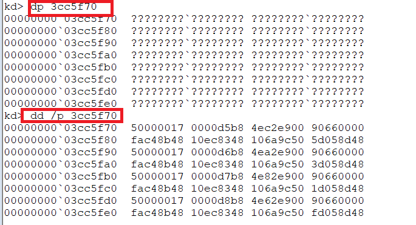

## 参考文献

* [Windbg调试命令详解](yiiyee.cn/blog/2013/08/23/windbg/
)
*[Windows 内核调试](https://zhuanlan.zhihu.com/p/47771088)